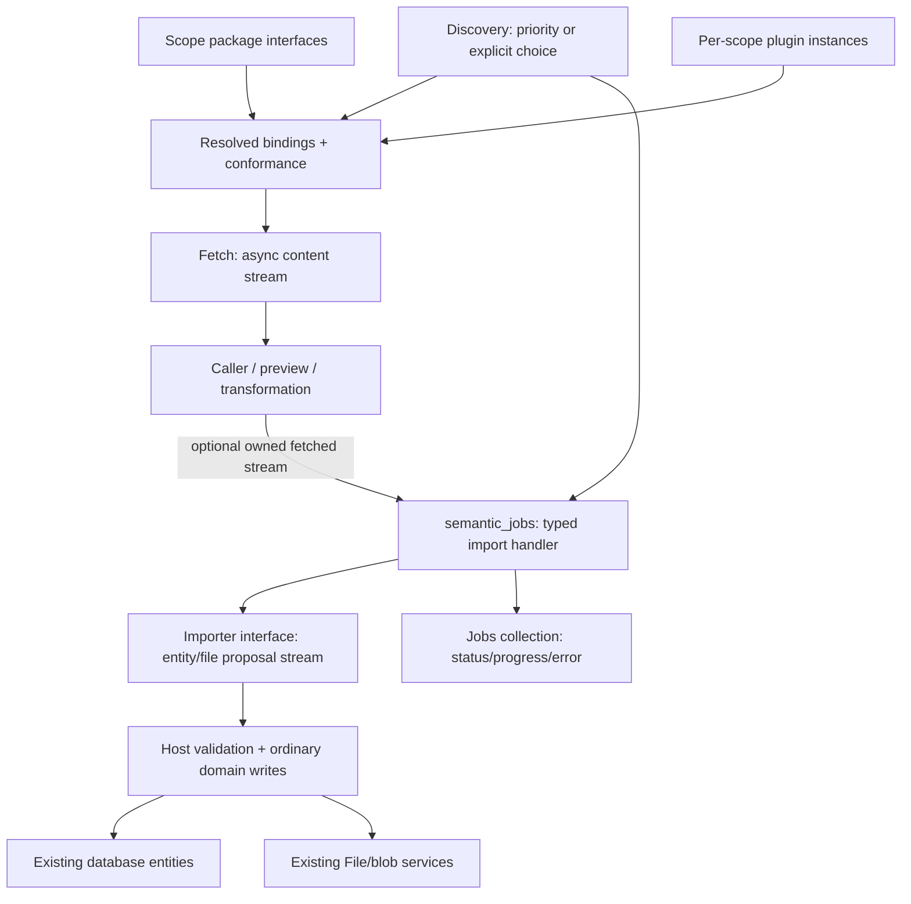

# Plugin, fetch, and importer system specification

Created: 2026-09-09. Revised: 2026-09-10 after the completed [questionnaire](questionnaire.md) and the [generic jobs design](../2026-09-10-jobs-system/design.md). Status: proposed implementation specification; this document does not claim these facilities already exist. The [implementation plan](implementation-plan.md) assigns phased agent work and acceptance gates.

The recorded answers and jobs specification supersede earlier recommendations in the research documents. This revision makes fetching and importing separate first-class operations, uses interface async streams, and delegates scheduling/history to `semantic_jobs`.

## 1. Product contract

Plugins implement interfaces declared in the existing package system. Execution providers are interchangeable behind one binding API:

| Provider | Registration and execution |
|---|---|
| Rust | An ordinary Rust plugin trait registered with the Semantic runtime by custom/embedding code. A factory creates a separate instance for each scope/activation generation. |
| Host stdio | A configured executable launched with `tokio::process`; asynchronous framed RPC runs over piped stdin/stdout. |
| Host WebSocket | A configured remote service reached through unauthenticated `ws://`, using HTTP upgrade and the same interface RPC session. |

Every activation has its own scope-specific instance and immutable configuration generation. All users may install descriptors, enable, configure, select, and invoke plugins while no permission system exists. Plugins are trusted code. No plugin authentication, WSS/TLS, secret provider, sandbox, OS-specific containment, or additional resource-limit framework is required initially; [TODO.md](../../../TODO.md) tracks future work. Existing application scope resolution and existing application transport behavior remain intact.

There is no embedded Wasmer runtime, Wasmer feature/dependency, WEBC persistence, registry integration, or `WebcPackageFile`. An ordinary stdio launch may invoke the Wasmer CLI. Its executable/guest/wrapper must speak the same protocol and reserve stdout for it; resolving/installing its packages belongs to that external command/deployment.

The first real capability is a built-in generic URL plugin implemented with the Rust trait. It fetches acceptable regular-file content without saving it, and imports that content as an ordinary File entity backed by the existing blob store. It has low priority; specialized importers can take precedence. Users can list matching importers and choose one explicitly.

Imported data always consists of ordinary entities in the existing database and ordinary files/blobs in existing services. Matching source identities use normal upsert/replace. There are no import-specific revisions, receipts, checkpoint records, durable working payloads, or alternate storage kinds. When generic entity versioning exists, an importer-level default and per-import override may delegate to it; versioned mode is unavailable until then.

Import jobs use the new `semantic_jobs` crate under one coordinator per scope, sharing its configurable concurrent-jobs limit with other job kinds. Jobs persist minimal status/progress/errors and lifecycle metadata in their dedicated collection. Inputs, output streams, bindings, fetched content, and other working state stay in memory. Restart interrupts unfinished work; a new operation requires new input.

## 2. Evidence and current async-stream gap

Research inputs:

- [Previous implementations](research-old-implementations.md): preserve separate fetch/semantic-preview/import operations, using current package interfaces instead of its duplicate Rust Source contracts.
- [Current interfaces](research-current-interface-system.md): normalization, lookup, implementation binding and conformance need work; its Wasmer/security/durability suggestions are superseded.
- [Host transports](research-host-plugin-transports.md): reuse RPC values/correlation and add sessions/stdio; its quotas, deadlines, WSS/auth, containment and page-based proposals are superseded.
- [Entity-versioning audit](research-entity-versioning.md): storage revisions are not first-class entity history.

The follow-up source check on 2026-09-10 resolves the stream question:

| Existing source | Finding and work |
|---|---|
| [StreamType](../../../crates/data/src/schema/behavior/stream_type.rs), [TypeKind](../../../crates/data/src/schema/core/type_kind.rs) | `TypeKind::Stream(StreamType { element, end })` already represents element and optional successful terminal data. Reuse it. |
| [FunctionType](../../../crates/data/src/schema/behavior/function_type.rs) | Parameters/results can reference streams. `async_fn` alone means an asynchronous call, not incremental output; `throws` supplies the declared error type. |
| [Package normalization](../../../crates/db_core/src/managed_schema.rs) | `normalize_type` traverses stream element/end types. Module interfaces and contract callables still need connection to function normalization. |
| [Command dispatch](../../../crates/rpc_core/src/command.rs), [protocol](../../../crates/rpc_core/src/protocol.rs), [client](../../../crates/rpc/src/client.rs) | Generic invocation returns one Value/response. Generic stream arguments/results, demand and stream cancellation are absent. |
| [File service](../../../crates/app/src/file.rs), [HTTP client](../../../crates/rpc/src/transport/http_client.rs) | File-specific streaming exists. It is not generic interface streaming, but its upload/hash/blob pipeline is reusable. |

Schema support exists; callable runtime/RPC support must be implemented as required foundational work. Add it alongside existing unary commands. Do not change Value into a container for live streams or silently change public unary wire messages.

## 3. Architecture and dependency direction



Fetching is request/stream-scoped and need not create a job. Importing is job-scoped and commits domain data. Both use the same provider bindings and content DTOs. Jobs knows neither those DTOs nor providers.

| Proposed location | Responsibility |
|---|---|
| `crates/data/src/plugin.rs`, `import.rs` | Portable manifests/descriptors, interfaces, content/error DTOs and ordinary source metadata attributes. |
| Existing `db_core` package/catalog modules | Callable normalization, authoritative read-only resolution and compatibility diagnostics. |
| `crates/rpc_core/src/interface.rs`, `interface_protocol.rs` | Portable binding descriptors and stream-aware session messages. |
| `crates/rpc/src/interface/` | Invocation/stream adapters, shared session kernel and client/server/SDK integration. |
| `crates/rpc/src/plugin/` | Stdio framing/process owner and WebSocket connection adapters. |
| New `crates/plugin/` (`semantic_plugin`) | Rust trait registration, per-scope activation, immutable bindings and provider lifecycle. |
| New `crates/import/` (`semantic_import`) | Discovery, fetch service, importer bindings, typed jobs handler, validation and domain-writer traits. |
| New `crates/jobs/` (`semantic_jobs`) | Generic scheduler/history, specified separately; no importer dependency. |
| App plugin/import modules and File service | Scope/database/file adapters, internal File preparation seam, registration and lifecycle integration. |
| Existing CLI/UI/SDK modules | Candidate chooser, fetch/import actions and jobs integration. |

Portable data/rpc_core must not acquire process/network runtime dependencies. Runtime rpc depends on rpc_core; plugin uses its common interface API and optional providers; import depends on plugin, portable DTOs and jobs. Application code supplies scope-bound domain services. Neither plugin nor import depends on app. Keep `DbScopeId` in app; supply bound services/opaque runtime keys rather than moving core scope types for convenience.

Rust-only use does not require stdio/WS features. Descriptors for unavailable compiled providers remain inspectable and fail activation with `provider_unavailable`.

## 4. Package interfaces and binding contract

### 4.1 Canonical declarations and compatibility

Use built-in `semantic.plugin` and `semantic.import` packages, named `v1` module interfaces, and ordinary package migrations for persisted classes/attributes. Jobs owns its separate package. Generate/adapt helpers from one declaration per interface, without a parallel importer trait contract.

An interface reference is `(package, module, optional contract, interface name)`. InterfaceType has no independent ID/version field; do not invent one in core schema structures. Package version and a normalized interface fingerprint identify compatible callable definitions. Each plugin has stable export names; several plugins may implement the same interface.

Normalize/resolve all parameters/results/throws, stream element/end definitions and reachable references. Reject duplicate methods/exports and unresolved references before publication. Catalog persistence already holds complete packages; lookup is a resolved view, not new callable DDL or a dependency solver.

Fingerprint deterministic canonical schema bytes with a versioned domain separator and sorted reachable-definition table. Include type identity/constraints, argument/result order, async/throws and stream definitions; exclude display text/method enumeration order. Handle recursion via references. V1 requires an explicitly accepted fingerprint and declared package version; exact requirements suffice initially. Richer semver/subtyping compatibility remains an extension.

The manifest and authoritative scope catalog determine exports; peers cannot redefine them in negotiation. Bind by scope activation generation/export/fingerprint and retain an immutable binding during invocation. Affected catalog changes use the same cancellation/revalidation sequence as plugin changes before relevant schema migrations proceed.

### 4.2 Stream-aware runtime profile

Ordinary values use existing Value/codecs. Runtime arguments additionally have an owned stream variant outside Value; wire arguments contain an invocation-associated stream reference. No live stream is serialized into entities.

The initial shared profile supports ordinary value-only calls; at most one top-level input stream alongside ordinary arguments; and either ordinary results or one top-level output stream. Element/end data use ordinary representable values and schema validation. This supports fetch, source imports and fetched-input transforms. Nested streams, stream-of-streams, function-valued parameters, runtime interface values and general own/borrow handles are unnecessary initially. Reject unsupported bindings consistently for Rust/external providers without narrowing the general schema itself.

A stream yields ordered `Item(Value)` events, then exactly one `End(optional terminal Value)` or failure. Terminal data must match StreamType.end, including its absence. Application errors before/during streaming validate against FunctionType.throws; system/transport failures use InvocationError. Unexpected underlying EOF is failure. No item follows terminal.

API-shape pseudocode:

```rust
pub trait Plugin: Send + Sync + 'static {
    fn manifest(&self) -> &PluginManifest;

    fn create<'a>(
        &'a self,
        context: PluginInstanceContext,
    ) -> Pin<Box<dyn Future<Output = Result<Arc<dyn InterfaceImplementation>, PluginError>> + Send + 'a>>;
}

pub trait InterfaceImplementation: Send + Sync + 'static {
    fn descriptors(&self) -> &[ImplementationDescriptor];

    fn invoke<'a>(
        &'a self,
        call: ValidatedInvocation, // values plus an optional owned input stream
        context: InvocationContext,
    ) -> Pin<Box<dyn Future<Output = Result<InvocationOutput, InvocationError>> + Send + 'a>>;
}
```

InvocationOutput can own a stream independently of its initial future. InvocationContext supplies identity, generation cancellation and tracing, with no invented principal/grant/deadline framework. Scoped services are explicit adapter dependencies. Trusted Rust plugins may capture dependencies through custom code; a factory is an idiomatic implementation of trait registration that creates distinct scope instances, not a separate dynamic-loading system.

Arguments transfer stream ownership to the callee; results transfer it to the caller. Dropping an owned stream stops demand and signals its producer. Session close invalidates all its streams. An input stream transferred into a queued job may outlive the unary submission response; keep its stream state alive until terminal/cancel and require the client producer/session to stay alive. Do not close transferred input automatically on `Return(job_id)`.

Existing RuntimePackage/RpcRegistry/typed commands remain usable. Add interface exports and adapters where signatures match; do not force unrelated commands through plugin lifetimes.

## 5. Installation and per-scope lifecycle

Installation makes a typed descriptor available in a scope. Store installation/activation/configuration entities in a `semantic.plugin` collection in that scope's DB. The application Rust registry supplies factory keys; persisted descriptors reference keys, not serialized Rust code. Stdio references accessible executables/arguments; WS references endpoints. No artifact downloader or registry is implied.

The typed versioned manifest contains plugin ID, implementation revision, display metadata, provider settings, exports/interface requirements, configuration schema and optional source metadata. Activation records contain installation/revision, desired enablement, typed configuration, priority override and generation. Configuration is ordinary data; secret providers/references are future work. Health, sessions/processes, bindings, cancellation tokens and jobs groups are ephemeral.

Live states are Disabled, Starting, Ready, Stopping, Unavailable and Incompatible. Startup is single-flight. Validate descriptors/config, ensure required packages through existing registration, then negotiate/conform an unpublished candidate before publishing an immutable registry snapshot. Do not hold registry locks across I/O. Package registration and process startup are separate: installed schema may remain after startup fails; no cross-package/process transaction is claimed.

Each generation owns a generic jobs JobGroup through app integration and a cancellation token for direct calls/fetch. Plugin/config changes, disable/uninstall and affected interface changes follow:

1. Close old binding admissions, including direct fetch/invoke.
2. Invalidate its jobs group with a simple plugin_changed/plugin_disabled reason. Stale selections cannot submit against it.
3. Signal old direct calls/streams. Import handlers stop admitting content/writes after observing cancellation and finish already-admitted writes.
4. Await affected handlers/provider cleanup; publish replacement with a fresh group/token only afterward. A privately prepared candidate is not admitted while old work is stopping.

No old revision is retained for resume. Cooperative cancellation without a grace/force policy can leave a Rust handler cancelling and its generation stopping; report it honestly. Closing remote streams does not prove the remote service stopped, only that old output will no longer be accepted into new host writes.

Integrate with jobs' scope activity guard/asynchronous shutdown. Do not reopen an active scope into a second coordinator/instance set. Uninstall retains imported data/schema unless separately managed through normal APIs.

Automatic restart/backoff, reconnect loops, crash budgets, pools and per-plugin admission are follow-ups. Failed instances initially become unavailable; explicit restart/reconnection creates a fresh session and never replays imports.

## 6. Fetch and importer capabilities

### 6.1 Interfaces and operations

Declare these in `semantic.import/v1` with ordinary schema DTOs:

| Interface | Methods | Effects |
|---|---|---|
| Source | describe; probe(request, operation) | Descriptor and supported/unsupported/unavailable response, without host persistence. |
| Fetcher | fetch(request) → Stream<ContentEvent, ContentSummary> | Read/transform source content for the caller; no entities/Files/blobs committed. |
| Importer | import_source(request) → Stream<ContentEvent, ContentSummary>; import_fetched(request, content: Stream<ContentEvent, ContentSummary>) → Stream<ContentEvent, ContentSummary> | Produce complete import proposals; the host import service validates/persists them. |

All methods are async with a declared ImportError. Plugins can export Source+Fetcher, Source+Importer, or both. Importers describe accepted input representations; import_fetched returns unsupported_input for unsupported ones. The URL plugin implements both importer methods and Fetcher. SDK pass-through helpers use the same schema signatures.

Public host operations are fetch, start_import_source and start_import_fetched. Only the latter two submit the generic import handler and persist proposals. Plugin import methods perform the production/transformation part of that workflow; host persistence makes it an import. External plugins need no broad application credentials or DB callbacks.

Separate import_source avoids bouncing a fetched stream plugin → host → same plugin during an ordinary source import. Implementations share their internal source reader/converter between fetch and import_source. Import_fetched preserves explicit reuse/transformation of caller-supplied fetched content.

SourceRequest initially contains URL and package-typed options. FetchedRequest identifies source namespace/identity, supplied representation and options; its stream is a separate top-level parameter. Later file/inline input variants extend the package deliberately; remote plugins do not implicitly accept host filesystem paths.

### 6.2 Content stream

Use ordinary DTOs for a sequential content stream:

```text
ContentEvent =
    Entity { key, class, attributes }
  | FileStart { key, filename?, mime_type, expected_size?, attributes }
  | FileBytes { bytes }
  | FileEnd

ContentSummary = { items, bytes }
```

Key is source-local identity. Entity attributes are semantic values with declared package classes; File metadata uses normal File fields/source attributes. ContentSummary is an ephemeral successful producer summary, not proof of commits or a job ledger. The host accounts for actual writes independently.

At most one file is open. FileBytes/FileEnd require FileStart, with no entity/file interleaving until it ends. Failure/terminal inside a file means incomplete content and no publication of that File. Empty files are legal. Structured entities are yielded individually; full file bytes never reside in an entity payload. This serial shape avoids nested streams, read-range RPC and per-file remote resource registries.

Fetch validates shape/representation without DB/blob mutation. Callers can display semantic objects/metadata, consume bytes or transfer an owned stream to import. Fetch is single-pass/ephemeral: consumed/discarded content cannot later be replayed from a nonexistent server cache. Callers may refetch, retain/replay using their own runtime resources, or transfer unconsumed content. Initial UI can preview metadata and start a fresh source import; it must not claim the import represents an earlier preview snapshot if the source changed.

Import additionally validates complete entity/File constraints before publication. A partial semantic preview must be transformed into valid proposals or fail explicitly. Unknown classes, invalid attributes/references, unacceptable content or incomplete files fail the operation; no automatic skip-invalid mode.

### 6.3 Discovery and selection

SourceDescriptor carries namespace/title, operations/input kinds, static URL hints and default priority. Scope configuration can override priority. Initial default is 0; generic URL is -100; higher wins. Ties use stable plugin ID then export name, never map iteration or probe completion timing.

Filter ready compatible bindings by operation/static hints, then probe sequentially in candidate order. No separate probe concurrency/deadline/cache subsystem is needed. Distinguish supported, unsupported and unavailable/error. List matching candidates with priority, operations and reasons; unavailable ones may be shown separately but are not automatically selected.

Explicit choice wins when supported. Otherwise choose the highest-priority supported candidate. No self-reported confidence overrides ordering. Select once per operation and do not fallback silently after failure. Capture immutable binding/group so a generation change causes stale submission to fail with plugin_changed.

## 7. Import execution on generic jobs

[Jobs design sections 5–10](../2026-09-10-jobs-system/design.md) govern typed registration/submission, cancellation, persistence failure, restart and groups. Register one reusable ImportJobHandler, e.g. kind `semantic.import`. Its owned input holds selected binding/generation, source or fetched stream, options and scope-bound writer. Streams need Send + 'static, not serialization/Clone.

Submission validates shape/selection, captures the group and calls ScopeJobs::submit. If a supplied fetched stream is still produced by another host-managed plugin generation, capture that upstream generation's group as well: jobs already accepts multiple groups. The native fetched-stream wrapper carries this runtime dependency metadata outside its content values; callers cannot manufacture authoritative group handles over the wire. Changing either dependency cancels the affected import rather than merely causing an unrelated input failure. An independent caller-supplied stream has only its known host dependencies and connection lifetime. URLs/options/configuration/content/proposals/output IDs do not enter JobRecord. A typed completion can return a small runtime summary. Durable results remain normal entity/File queries with optional source attributes, independent of retained jobs.

Handler pipeline:

1. Check cancellation, open the selected importer stream and report phase.
2. Pull/validate content as the writer is ready. Forward bytes into existing file/blob APIs without collecting the file/import.
3. Before each publication, check cancellation and admit that individual write in the handler's serial path. Await an admitted DB operation rather than dropping it during cancellation.
4. Report successfully written items; byte transfer can use a separate byte phase. Progress is observational latest state, coalesced by jobs.
5. At valid terminal, finish writer/provider cleanup and return. On error, stop new consumption/writes, clean owned resources and return a simple code/message.

There is no importer scheduler/table, attempt state, durable checkpoint/replay key, resume method or automatic retry. Use jobs statuses exactly: Queued, Running, Cancelling, Succeeded, Failed, Cancelled, Interrupted. A queued fetched stream stays runtime-only; its producing resource/connection must survive until consumed. Disconnect is an input error, not a recoverable payload.

Job status cancellation is ordered by its coordinator. The importer checks the token before admitting the next write; an admitted write may finish and previous commits remain. Jobs metadata and domain writes are not one transaction. Failure/ambiguous DB response can leave visible output despite lagging progress/failed status. Do not replay/refetch automatically after uncertainty; a new user operation can apply normal upserts.

On restart jobs marks stale nonterminal records Interrupted before admission. Desired activations reopen fresh instances/groups; no import/fetch resumes. Config changes cancel rather than mutate queued inputs to use new code. Concurrency/defaults/retention/commands remain owned by jobs.

## 8. Domain identity, publication and Files

### 8.1 Normal source identity and replacement

Derive entity ID from canonical length-delimited encoding of `(source namespace, source identity, item key)` under a versioned hash domain. Scope comes from the bound DB. Exclude job/invocation IDs, implementation/config revision and content hash. Namespace is stable descriptor metadata.

Generic URL uses namespace `semantic.url-file`, the parsed requested URL's canonical serialization, and key `file`. Preserve query ordering/values and fragment; do not invent URL equivalences. Redirects affect fetched metadata/location, while original requested URL remains identity. Distinct namespaces may intentionally produce different entities for the same URL; cross-source reconciliation is separate.

Declare normal source namespace/identity/key attributes on output where useful. They are domain provenance/query fields, not a mapping ledger or mandatory job foreign key.

Map validated proposals to normal domain-collection upserts. Initial full replacement can replace earlier imported/user-edited values on the same entity. No field merging, manual revisions, importer-specific optimistic concurrency or source deletion is added. Concurrent imports follow ordinary DB last-successful-write semantics; a single jobs coordinator does not serialize all domain effects.

Resolve references using ordinary IDs. Deterministic source IDs avoid storing a job-sized map. Producers initially emit required referenced entities first; unresolved forward/cyclic relationships fail if current validation requires targets to exist. No hidden placeholders/whole-import graph buffer. Atomic multi-entity domain operations can be separately specified when required.

### 8.2 Per-item publication and partial results

Boundary: one complete entity or one complete File entity. Validate/write through existing single-record/batch APIs; future internal batching must preserve this behavior. A File is complete after content is stored/verified and its entity upsert succeeds. No importer pagination, page sequence or cursor is exposed.

Items become visible when committed. Later failure/cancel preserves prior data. Fail-fast rejects the current invalid item, not earlier commits. UI/errors communicate this partial-result possibility. Whole-import atomicity, skip-invalid and durable commit reconciliation are not initial guarantees.

### 8.3 Existing File/blob pipeline

Current FileService streams to a temporary blob, computes hash/size, copies to a final locator, constructs File attributes and inserts the entity. Its optional requested entity ID also defaults the blob locator. Passing a stable source ID directly can replace old bytes before the replacement DB write succeeds.

Add a narrow internal preparation helper reusing upload/hash/metadata code and returning a prepared normal File after bytes are available. The importer chooses a content-addressed final blob locator independently of its stable entity ID, then performs ordinary entity upsert. Refactor shared internals only as necessary; preserve FileService::create defaults, media behavior, exact class validation and public read/range/upload APIs. No global locator/identity change or File subclass.

Transfer/hash/required metadata are on the import path. Optional existing media analysis must not force whole-file materialization; for the new importer, use existing analysis configuration or leave optional analysis to a later ordinary action. Preserve existing File callers' behavior. Freeze this choice in implementation fixtures, without adding an import quota.

Clean a runtime-owned temporary upload on known failure/cancel through existing cleanup. Do not blindly drop an unknown in-flight store operation. Final content may remain orphaned after DB failure/crash; this is an existing blob lifecycle concern. Add no stage/job-payload ledger. Never delete shared final content because one job failed/history was cleared. General orphan maintenance is [future work](../../../TODO.md).

DB/blob writes are not one transaction. Tests must prove failed replacement leaves the old File readable with its old bytes, and successful publication references finalized content. Existing backend/store capabilities suffice; no new storage implementation is needed.

## 9. Built-in generic URL plugin

Register GenericUrlPlugin with the same ordinary Rust trait/application API as custom plugins, exporting Source/Fetcher/Importer at priority -100. Each instance keeps scope/generation configuration separate while immutable HTTP-client internals may be shared safely.

Probe cheaply accepts syntactically valid HTTP/HTTPS URLs; actual content eligibility is checked on response. Use one streaming GET, not a required HEAD or full-body download for metadata. HTTP/HTTPS source fetching is separate from the ws-only plugin transport.

Use the HTTP client's normal redirect/loop behavior and require a successful final response. Original URL remains identity. Invalid redirect/scheme, network failure, non-success status and body error become simple typed errors. No source auth/cookies/browser/scraping/custom network-policy framework is required.

Initial reasonable-content policy, shared by fetch/import:

| Content | Behavior |
|---|---|
| Images, audio, video, fonts | Accept recognized families, including SVG as stored bytes without rendering. |
| PDF, common documents/archives | Accept explicit common MIME types, including ZIP/GZIP/TAR/7z and supported Office/OpenDocument names. |
| Plain text, CSV, Markdown, JSON, XML | Accept as regular files; higher-priority specialized importers may handle them. |
| Octet-stream or missing MIME | Accept when attachment filename or final URL path has a recognized regular-file extension; derive metadata from that mapping. Otherwise unsupported. |
| HTML/XHTML, event streams, multipart responses | Unsupported by generic file importer. |

Normalize MIME case/parameters. A misleading extension does not override a rejected MIME. Filename comes from Content-Disposition, final URL path, then a generic name; it is metadata, never a filesystem path. Preserve reliable expected decoded length when available; never compare compressed Content-Length to decompressed bytes. Record actual byte count/hash. Length mismatch is validation, not a size quota.

Fetch emits FileStart, streamed body chunks, FileEnd and summary without accessing DB/blob services. import_source shares its reader and sends proposals once to the host; import_fetched validates supplied file events and type policy. Accepted empty files succeed; interrupted responses do not publish Files.

No new size/bandwidth/duration/invocation/buffer/timeout policy. Audit/document inherited library limits and redirect behavior without creating new plugin controls. Memory can still grow with queued input, item size, concurrent fetches or library buffers; a job concurrency limit alone is not a global bound.

## 10. Common interface RPC streams

### 10.1 Session and protocol

Add a versioned interface session in semantic_rpc, reused by both providers and stream-capable application clients/endpoints. Legacy unary encoding remains intact. Plugin endpoint subprotocol is `semantic.plugin.v1`; application interface endpoint can use `semantic.interface.v1` with existing request scope resolution. Bootstrap/export setup differs; invocation/streams share one kernel.

Handshake exchanges version/profile, expected plugin revision where applicable, exact exports/fingerprints and codec. Supply configuration after conformance; publish readiness only after acknowledgment. Use typed-Value JSON. This is compatibility negotiation, not authentication/attestation. Initial negotiation has no quota/deadline/credential/grant machinery.

Core messages: Call, Return, CancelCall, StreamDemand, StreamItem, StreamEnd, StreamError, StreamCancel, Shutdown, ShutdownAck. Calls use negotiated method/export slots and ordered value/stream arguments. Returns contain values, stream reference, declared error or system error. References are session/direction-local and typed by method position, not persistent IDs/general resource handles.

Use monotonically issued direction-local call/stream IDs as decimal strings; never reuse in a session. Keep high-water marks and live maps, not tombstone history. Late messages for retired issued IDs may be ignored; future/never-issued/wrong-direction IDs are violations. Reject unsolicited/duplicate/out-of-order items and data after terminal.

Native poll readiness becomes stream demand. Initial consumption requests the next element; no importer method, source cursor, file offset or commit checkpoint is involved. StreamDemand can express cumulative sequence demand so a future measured window optimization preserves the API. No initial buffer/window setting is exposed. Backpressure is stream semantics, not an additional configurable resource quota.

One reader and writer own each transport. The reader demultiplexes without waiting for application consumption, avoiding deadlock in input/output transforms. Demand corresponds to a consumer-ready handoff slot; deposit the requested item and continue processing control. Fairly service ready streams/control. Do not poll a producer without demand or eagerly queue its whole output.

Per-element demand trades round-trip cost for a clear initial implementation. Measure real/simulated RTT, chunk sizes and JSON overhead; document high-latency throughput costs. Wider demand windows, binary frames and chunk coalescing remain optimizations behind the same typed contract, not pagination.

No new frame/depth/node/call-count quota. Validate lengths for syntax/overflow/completeness with existing codec/library validation. Do not claim malicious-input memory isolation or global bounds. New thresholds and buffering policies are deferred.

### 10.2 Ownership, cancellation and errors

A stream return establishes the channel; its operation terminates with the stream. A callee may transfer an input into jobs and return before EOF; keep its stream lifetime independently. Native/SDK adapters must expose this ownership explicitly.

Dropping/cancelling fetch closes demand/streams and sends cancellation. Import cancel signals JobContext, stops related calls/streams and awaits admitted domain operations/cleanup before terminal status. A transform's input/output share cancellation; failure releases the other direction. Control handling continues while either side awaits demand.

Disconnect fails every pending call/stream as connection_lost or outcome_unknown. Never silently convert to EOF/success, replay, or claim remote execution stopped. Stable errors cover invalid argument/output, unsupported input/content, interface incompatibility, provider unavailable, plugin changed, cancelled, source/storage failure, connection lost, unknown outcome and protocol violation. Store concise code/message only; no diagnostics tree/redaction subsystem.

No heartbeat deadline, invocation timeout, cancellation grace or forced-abort policy. A peer ignoring cancellation may leave work running/cancelling; expose it honestly.

### 10.3 Stdio and WebSocket

Stdio frames are `Content-Length: <decimal bytes>\r\n\r\n<body>`, optionally with a fixed content-type header. Handle split/coalesced reads, reject duplicate/missing/invalid/overflow length and partial EOF. Stdout is protocol-only. Concurrently drain stderr to normal runtime logging rather than retaining an ever-growing capture; it is not job data.

Use tokio::process::Command with separate program/args and optional cwd/environment, piped stdio and one child owner. No implicit shell. Spawn once per generation. kill_on_drop is fallback; normal stop closes admissions, cooperatively cleans affected calls, closes stdin and explicitly waits/reaps. Portable explicit direct-child termination may be a separate lifecycle action, but no timed escalation is required. Track only the direct child; no process groups, Job Objects, descendant containment or OS-specific release gate. A noncooperative child can leave stopping pending.

WS connects through HTTP upgrade to configured ws:// with the plugin subprotocol. One complete text message is an envelope; library fragmentation is transparent; unnegotiated binary is rejected. Do not add WSS/TLS/auth/credential/origin-policy machinery or remote process supervision to this adapter. Close fails streams; explicit reconnect uses fresh IDs/conformance without resume.

## 11. Application APIs, UI and retention

Expose scope-aware plugin controls and these importer operations using canonical package DTOs. Unary candidates/source-start fit current commands; streaming fetch/fetched-start use the common interface API and native/CLI/WS clients.

| Operation | Behavior |
|---|---|
| semantic.import.candidates | URL + operation → ordered candidates/priorities/capabilities/reasons. |
| semantic.import.fetch | Explicit or priority selection → live content stream; no job/content persistence required. |
| semantic.import.start_source | Transfer URL/options/binding into typed jobs; return job ID promptly. |
| semantic.import.start_fetched | Transfer caller content stream/metadata into jobs; return ID while producer/transfer remains live. |
| semantic.jobs.* | Reuse list/get/cancel/clear_completed/kinds; no importer status/resume subsystem. |

Native callers can transfer fetched streams directly. Remote clients retain producer/session while queued/running consumption occurs; SDK helpers return job ID plus a transfer-lifetime handle where needed. Do not treat a wire stream reference as durable content. Disconnection cannot be recovered from the job row.

UI flow: enter URL, see priority-ordered choices, accept preferred or select explicitly, optionally fetch/view available content, start import, and follow it in jobs. Normal data browsing shows results. Polling jobs is sufficient. No persistent output/receipt/checkpoint view, preview cache or automatic retry/resume button.

Jobs retention follows its plan exactly: configurable soft count threshold; periodic oldest-terminal deletion by creation time then ID; active jobs protected. Succeeded/failed/cancelled/interrupted are all completed. Jobs UI exposes clear_completed. Cleanup deletes job history/errors only, never domain entities/blobs. Defaults of four concurrent jobs and 1,000 retained rows come from jobs configuration, not duplicated importer settings.

## 12. Failure, performance and verification

| Scenario | Required result |
|---|---|
| Fetch success/cancel | Content or cancellation; no entity/File/blob writes. |
| Reimport same URL | Same source ID replaced; final blob locator follows content. |
| Later item fails | Earlier results remain; simple failed job with potentially lagging progress. |
| Terminal inside file | Current File unpublished; earlier results retained. |
| Plugin/config change | Old group rejects stale submissions; affected jobs cancel; fresh replacement group. |
| Cancel races DB write | Admitted write may finish; no new write after handler accepts cancellation. |
| Blob succeeds, replacement DB fails | Old File readable; orphaned final content possible. |
| Domain/metadata acknowledgment lost | Owning API reports uncertainty; no automatic replay or fabricated receipt. |
| Restart | Unfinished jobs interrupted; inputs lost; desired plugins reopen fresh. |
| History cleanup | Entities/Files/blobs remain. |
| Child/session failure | Pending streams fail; no implicit fallback/resume. |
| Noncooperative handler/peer | Cancelling/stopping can persist; no forced-stop guarantee. |

Cache immutable normalized definitions/validators by fingerprint, share descriptors, keep sessions/processes long-lived and propagate demand. Avoid full-file/import materialization, tasks per queued job and progress DB writes per content event. Network parsing/validation stays outside DB operations. Memory includes queued input and working items; concurrency is not a global bound.

One conformance suite covers Rust, memory session, stdio and WS: normalization/fingerprints, values/errors, input/output streams, terminal/demand/cancel/disconnect, owned streams after unary return, negotiation mismatches and legacy API compatibility.

Importer tests cover ordering/explicit choice, fetch-without-writes, source/fetched import, changed content/upsert, MIME/redirect/body/empty cases, File replacement failure, partial output, cancellation/admission, invalidation/restart and cleanup isolation. Deterministic local HTTP/process/WS fixtures avoid public network dependence. Run a non-import handler alongside import jobs under the same limit.

Measure call/first-item latency, throughput, memory versus file length, progress-store writes and cancellation, including RTT/chunk/JSON effects. Extra quotas, protocol optimization, permissions/security, generic versioning, orphan cleanup, richer source types and distributed coordination remain [follow-ups](../../../TODO.md).

No new questionnaire is needed. Only concrete implementation evidence requiring material core behavior/type changes reopens a decision; phase acceptance belongs to the [implementation plan](implementation-plan.md).
