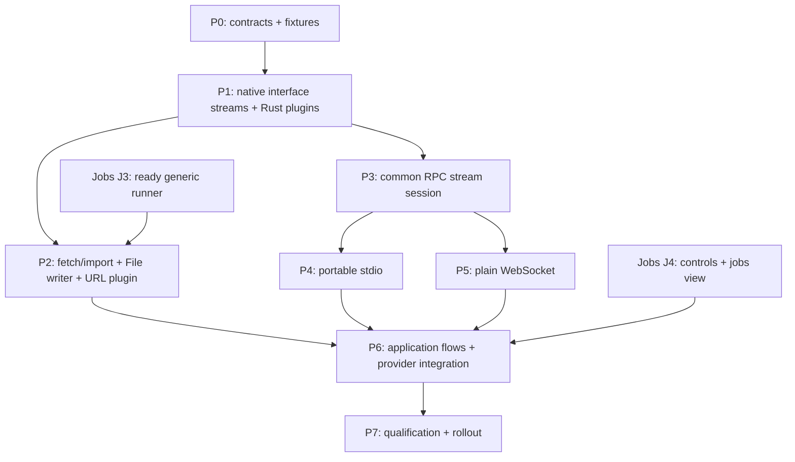

# Plugin, fetch, and importer implementation plan

Created: 2026-09-09. Revised: 2026-09-10. Governed by [design.md](design.md), the completed [questionnaire](questionnaire.md), and the [jobs design](../2026-09-10-jobs-system/design.md)/[jobs implementation plan](../2026-09-10-jobs-system/implementation-plan.md). This is documentation; implementation gates remain to be demonstrated.

## 1. Dependency order and milestones

The jobs design is complete as a planning dependency. Implement generic jobs independently through J3 before importer execution relies on it. Package/binding/stream work can proceed alongside jobs foundations. The first useful plugin milestone is nonpersisting fetch through a registered Rust plugin. The first importer milestone includes streamed URL-to-File import on generic jobs; files are not postponed.



P2 includes the domain integration described by jobs J5: one coordinated implementation, not duplicate handlers/groups. Jobs J4 owns retention/jobs view; P6 adds candidate/fetch/start flows. P3 is required for external streams and stream-capable application clients. P2 proves the native pipeline before transports finish.

Use an orchestrator with up to three bounded workstreams at a time. Publish DTO/API/wire fixtures before parallel work. One integrator owns shared Cargo manifests, exports, app-builder/scope wiring and public contract changes per phase. Each task packet specifies owned files, dependencies, frozen contract, acceptance cases, commands and handoff requirements. Preserve unrelated work and stop before aggressive core behavior/type changes.

No phase introduces importer job storage/scheduling, persisted working data, page-oriented execution, manual entity revisions, Wasmer/WEBC, auth/WSS/sandbox, OS-specific process logic, or execution limits beyond generic concurrent jobs. [TODO.md](../../../TODO.md) holds deferred work.

## 2. P0 — Freeze contracts and feasibility fixtures

Dependencies: accepted decisions and jobs specification. Output: contract/fixture pack and bounded implementation packets.

Tasks:

1. Freeze interface identities/fingerprints and stream profile: existing StreamType; one top-level input/output stream; ordinary element/end values; declared failures before/during stream; owned lifetimes independent of initial return.
2. Confirm design section 2's narrow source findings in tests: schema streams exist, generic RPC is unary. Locate additive runtime/protocol work without rewriting existing commands.
3. Freeze Plugin/InterfaceImplementation, activation generation, priority selection, Source/Fetcher/Importer interfaces, content framing and public fetch/start shapes. Source import and supplied-fetched import are distinct workflows.
4. Freeze initial policies: generic priority -100, others 0; stable tie order; MIME categories; original canonical URL identity; per-item visible commits; normal replacement; error rather than resume/replay.
5. Freeze jobs integration against J3: typed registration/input/ticket, progress, cancellation group and invalidation completion. Jobs records gain no domain fields.
6. Specify internal File helper with content-addressed locator independent of stable entity ID, existing upload/hash and delayed ordinary publication. Preserve current public defaults/media behavior for existing callers.
7. Publish deterministic fixture plugin producing entities/sequential files, controlled byte producer, demand/cancel probes, local HTTP fixture and fake writer with before/after-commit barriers.

Parallel packets: interface/stream owner; File/domain feasibility owner; fixture/jobs-seam owner. Only the contract owner edits shared DTOs.

Gate: dependencies acyclic; streams are not Value/job payloads; failed replacement cannot overwrite old bytes; missing facilities can be added without core entity/scope/transaction changes. Escalate concrete contrary evidence before implementation.

## 3. P1 — Package bindings, native streams and Rust lifecycle

Dependencies: P0. Output: ordinary Rust trait registration and per-scope bindings for value and stream calls.

| Workstream | Owned paths/responsibility |
|---|---|
| Package owner | Existing db_core normalization/catalog modules; portable identity/fingerprint helpers/tests. |
| Invocation owner | rpc_core interface declarations; rpc interface native argument/result/stream adapters and conformance fixture. |
| Plugin owner | New plugin manifest/registry/activation/rust/error modules; config-store trait; app persistence adapter through integrator. |

Tasks:

- Normalize module interfaces and contract functions/interfaces through function/type normalization, including stream element/end references; reject duplicate/unresolved names.
- Add authoritative read-only lookup and deterministic fingerprinting. Exact package/fingerprint requirements suffice; no solver/new callable DDL.
- Add runtime owned-stream arguments/results outside Value and validated terminal/error behavior. Unsupported nested streams/handles/function values fail uniformly.
- Expose Plugin trait/custom registration with separate per-scope/config-generation instances, duplicate rejection and immutable bindings.
- Add semantic.plugin descriptors/activation schema in a scope collection. Resolve Rust factory keys, stdio and WS descriptors even when providers are not compiled.
- Add single-flight startup and readiness/unavailable/incompatible states without locks across I/O. Preserve existing RuntimePackage/flat RPC behavior.
- Attach generation cancellation for direct calls/fetch; integrate actual jobs groups once J3 is ready, without inventing local substitutes.

Tests: callable/stream normalization; canonical recursion/order fingerprints; missing method/profile mismatch; typed/system errors; zero/many arguments; input/output streams; demand/drop/terminal; scope instance separation; duplicate keys; concurrent startup; unavailable feature; schema/start failure; disabled rejection; fetch cancellation on generation change.

Gate: canonical declarations drive helpers and conformance; custom code registers/consumes a native stream without transports. Existing package/command checks pass; data remains portable.

## 4. P2 — Fetch and streamed URL import on generic jobs

Dependencies: P1 and jobs J3. P2-A/B can develop against frozen fixtures earlier. Output: usable Rust URL fetch and File import under shared jobs.

### P2-A — Interfaces, discovery and fetch

Owned paths: data import package; import binding/discovery/fetch/content/error modules; fixture tests. Integrator owns shared exports/Cargo.

Tasks:

- Define Source/Fetcher/Importer, descriptors/requests/errors and content-event/summary schema. import_fetched accepts an owned input stream; import_source avoids host-to-same-plugin byte bounce.
- Implement operation-specific candidates, static hints, sequential probes, priority/stable tie ordering and explicit override. No fallback after execution starts.
- Implement nonpersisting fetch using the same binding. Do not resolve/create DB/blob services just to fetch; propagate stream drop/cancel.
- Validate representation/framing separately from full entity publishability. Document single-pass transfer/refetch behavior; no server preview cache.
- Declare ordinary source namespace/identity/key attributes, with no mapping/job-data collections.

Tests: priority/ties/explicit selection; unsupported/unavailable/capability diagnostics; stale generation; semantic/file fetch with zero DB/blob writes; empty success; invalid/incomplete framing; drop; native fetched-stream transfer.

### P2-B — Domain writer and File preparation

Owned paths: import writer/identity modules; app import writer; narrow internal FileService helper/refactor; file/backend integration tests.

Tasks:

- Implement versioned canonical source hashing independent of job/config/revision/content. Freeze URL query/fragment/redirect/implementation-update examples.
- Validate ordinary class/attribute proposals and construct normal domain upserts. Preserve stable source IDs; full replacement is initial behavior.
- Publish one complete entity/File at a time. Require references resolvable under current validation; fail unsupported forward/cyclic input without placeholders/whole-import graphs.
- Reuse upload/hash/metadata preparation with content-addressed final blob locators and separate stable entity IDs. Preserve FileService create/read/range/class behavior for existing callers.
- Keep byte processing incremental; settle optional analysis policy for the new importer without changing existing callers or adding quotas.
- Add cancellation-aware write admission: check first, then await admitted DB operations. Clean owned uploads/streams without discarding unknown writes or deleting shared final content.

Tests: repeated source replaces same ID; changed bytes/new locator; same bytes/distinct source IDs; config/revision retains identity; replacement of prior fields; invalid item not written; prior items survive later failure; references; file truncation/length/upload failure; DB failure after blob; old File still readable; cancel before/after admission; existing File regression suite.

Gate: only normal entities/File/blob data persists. No stage ledger/receipt/checkpoint/version chain/new store. Document orphan possibility without inventing recovery infrastructure.

### P2-C — Built-in URL plugin and jobs integration

Owned paths: import job/url modules; app submission/generation integration; Rust registration example; jobs/import fixtures. This is jobs J5's same domain work: coordinate ownership once.

Tasks:

- Implement GenericUrlPlugin as a registered Rust Plugin, exporting both fetch and importer methods at -100 priority.
- Share streaming GET/type validation between fetch/source import; accept supplied fetched file streams. No required HEAD/whole-body metadata detection/hidden fetch writes.
- Implement MIME mapping, requested URL identity, HTTP-client redirects, response/body/filename/decoded-length validation and simple errors. Source HTTP/HTTPS remains separate from plugin ws policy.
- Register ImportJobHandler on generic jobs. Keep request/binding/streams/writer runtime-owned; report progress via JobContext and return a small ephemeral summary.
- Allocate one group per generation. Include known upstream plugin groups when a fetched input is still produced by another host-managed generation; keep those handles in runtime metadata, never peer-supplied values. Stop old admissions, invalidate, cancel direct calls, await handlers/provider cleanup, then publish fresh group. Stale selected bindings fail submission.
- Use jobs statuses, cancellation, store-failure and interruption semantics. No resume/retry commands or URLs/config/bytes/output lists in persisted JobRecord.

Tests: deterministic HTTP accepted binary/text/document/empty; rejected HTML/XHTML/event/multipart; generic/missing MIME with/without extension; redirects/non-success; compression-length behavior; body failure; explicit generic selection; fetch-to-import reuse; mid-download cancel; queued/running config invalidation; different upstream fetch-plugin invalidation cancels dependent import; import/non-import handlers share N-job limit; restart interrupted without replay; cleanup leaves File/blob.

Milestone gate: native/CLI embedding discovers, fetches without writes, starts real URL-to-File import, observes/cancels via jobs, and reimports changed bytes into the same entity. Large File streaming is in this first importer milestone; working data remains runtime-only.

## 5. P3 — Shared RPC session with input/output streams

Dependencies: P1/P0 contracts. Runs alongside P2. Output: conformance over duplex memory and stream-capable app client/server.

Owned paths: rpc_core interface_protocol; rpc interface session/stream/transport/client/server modules; SDK/native/browser adapters and golden fixtures. One session owner controls state transitions.

Tasks:

- Implement version/profile/export handshake and design section 10 messages: call/return, owned stream references, demand/item/end/error/cancel and shutdown. Reuse typed Value JSON; preserve unary encoding.
- Implement monotonic direction-local decimal-string IDs, live state cleanup/high-water validation, and schema validation for elements/end/errors.
- Implement consumer demand and ready handoffs without eager output queues. Reader demultiplexing must not block on application consumption or deadlock duplex transforms.
- Permit transferred input streams to outlive submission Return. Client helpers retain producer/session ownership until terminal/cancel; queued disconnect propagates an input failure.
- Handle drop/cancel/terminal/disconnect without silent EOF/replay/reconnect/timeouts or new quotas.
- Add shared interface app endpoint/client alongside current RPC and existing scope resolution. Supply native/CLI and needed browser stream adapters; jobs gains no transport.
- Provide one SDK dispatcher for external executable/service fixtures, using identical package descriptors.

Parallel packets: wire/fixtures; session state machine; typed/client/server adapters. Publish goldens first; session transitions have one owner.

Tests: handshake/profile/export mismatch; wide IDs/values; out-of-order unary returns; duplex streams; successful end values; declared failures before/mid-stream; unsolicited/duplicate/out-of-order events; missing terminal; wrong direction/unknown stream; late issued IDs; cancellation races; slow-consumer demand; control while data waits; transform input/output; Return before input EOF; queued producer disconnect; close resolves pending state; repeated drop/complete does not leak maps/tasks.

Gate: native/memory conformance agrees and existing HTTP/WS/file clients still pass. Streaming is implemented here, not replaced by a temporary page protocol. Pagination remains browsing only.

## 6. P4 — Portable stdio host provider

Dependencies: P3; P2 fixture for importer parity. Output: same capabilities in a long-lived child.

Owned paths: rpc plugin stdio/process modules; plugin stdio provider; fixture executable/SDK example; launch docs.

Tasks:

- Implement Content-Length on generic async read/write, syntax/overflow/EOF checks without new size quotas. Stdout protocol-only; stderr continuously drained to runtime logging.
- Launch tokio::process::Command with separate program/args, optional cwd/environment, piped stdio and one child owner.
- Spawn once per scope/activation single-flight. Check exact configured process health.
- On stop/update close admissions, cancel owned operations, close stdin and explicitly await/reap direct child. Document cooperative teardown. No process groups/Job Objects/descendant guarantee/automatic grace timer.
- Child failure closes session and marks unavailable. Explicit restart uses fresh session without replay.
- Add ordinary launch profile example, optionally Wasmer CLI with protocol-speaking guest/wrapper. No Wasmer/package required for build/tests.

Tests: split/coalesced frames; Unicode lengths/newlines; duplicate/missing/overflow length; partial EOF/stdout contamination; simultaneous pipes/stderr; exit during handshake/stream; drop/cancel; repeated clean direct-child reap; explicit restart; no whole-output buffering; Rust/stdio fetch-import parity.

Gate: portable Tokio process logic with no OS-specific support gate. Noncooperative shutdown remains pending rather than satisfying an invented teardown deadline. Bytes stream incrementally.

## 7. P5 — Plain WebSocket host provider

Dependencies: P3; P2 parity fixture. Runs alongside P4. Output: remote ws:// interfaces.

Owned paths: rpc/plugin WebSocket adapter; plugin WS provider; loopback SDK service and endpoint docs.

Tasks:

- Connect via HTTP upgrade/subprotocol semantic.plugin.v1 and map one text message to one shared envelope.
- Validate subprotocol/scheme/codec; WSS/auth/TLS are unsupported initial capabilities.
- Map close/read/write errors to common unavailable/session failures. Only explicit fresh reconnect, with no replay or remote process lifecycle.
- Reuse stdio/native SDK dispatch and separate plugin/application bootstrap context without duplicate stream code.

Tests: wrong/missing subprotocol; library text fragmentation; unexpected binary; concurrent/duplex calls; slow demand; fetch/import/upload disconnect; stale session; explicit reconnect; cancellation without remote-stop claim; provider output/identity parity.

Gate: plain unauthenticated ws:// and native/stdio-equivalent streams. Document inherited library behavior; no new product quotas/security framework.

## 8. P6 — Application flows and provider integration

Dependencies: P2/P4/P5 and jobs J4. Output: candidate/fetch/import UI/APIs and complete scope/provider wiring.

| Workstream | Deliverables |
|---|---|
| Application/SDK owner | Candidate/fetch/start-source/start-fetched APIs, transfer-lifetime helpers and scope plugin controls. |
| UI/CLI owner | Priority-ordered URL candidate chooser, explicit override, fetch action, import start and existing jobs-view navigation. |
| Integrator | All-provider conformance, scope/group/update lifecycle, backend/File/jobs tests and shared files. |

Tasks:

- Expose design section 11 operation matrix using canonical DTOs. Source start returns ID promptly; fetch returns content without persistent job result.
- Keep native/remote supplied streams alive across queueing/Return. Disconnection fails input; no fetch-ID cache/upload ledger/auto retry.
- Wire all-user controls with existing scope resolution and per-scope instances/readiness.
- Present explicit/priority choice and visible selected-importer failure. Generic URL remains fallback.
- Reuse J4 jobs view/list/get/cancel/clear_completed. Preserve Interrupted/terminal/retention semantics; do not duplicate history management or add result/checkpoint views.
- Integrate asynchronous scope close/app shutdown with jobs activity ownership and provider cleanup; prevent overlapping scope generation/coordinator creation.
- Run fixture on all providers with actual DB/blob adapters and minimal restart/history behavior.

Tests: scope routing/private identity; candidate updates; config change cancels queued/running/direct fetch; disable; prompt start response; fetched stream outlives Return; dropped ticket versus dropped producer; UI cancelling/interrupted/error; history-only clear; unknown kind; stale selection; reimport after update; no persisted runtime payload.

Gate: users can list/choose/fetch/import/manage jobs end-to-end. Fetched-input import is actually tested. Portable/browser bundles exclude native jobs/processes. No generic resume/retry action.

## 9. P7 — Qualification and rollout

Dependencies: P6. Output: behavior/runbook, build/backend compatibility and measured baselines.

Review workstreams:

- Interfaces/providers: normalization/fingerprints, ownership/demand/errors, unary compatibility, child/session cleanup and generation changes.
- Domain/jobs: stable replacement/content-addressed blobs, per-item partial results, cancel/write ordering, restart/store-failure/retention and no persisted working data.
- Product/performance: priority/fetch distinction, jobs usability, incremental memory, latency/throughput and simple controls.

Feature matrix: native Rust only, stdio, WS, all providers, and existing portable/browser clients. No Wasmer dependencies/features. Qualify current DB/blob adapters using their established tests; no new backend/distributed transaction requirement.

Measure first-item/call latency, sustained bytes, memory versus file length, shared import/non-import concurrency and progress-store writes. Include simulated RTT and actual chunk/JSON overhead for per-element demand. Queues/items have no global quota: prove incremental processing, not nonexistent global bounds. Wider demand/binary/chunk optimizations remain measured follow-ups.

Rollout:

1. Register packages/jobs/custom Rust fixture in development; verify scope init and preserved commands.
2. Enable generic URL: fetch no writes, import File/blob, repeat same source replaces same entity.
3. Enable chooser/jobs controls; verify cancel/partial output/clear/retention/restart without replay.
4. Enable stdio then WS fixtures/canaries after conformance. Transport failure requires new user operation, never hidden fallback.
5. Exercise update ordering: close admissions, invalidate group, await cleanup, fresh instance/group; retain schema/domain data on disable/uninstall.

Runbook covers incompatible/missing provider, stopping/cancelling, source rejection, partial failed import, disconnected fetched input, jobs storage unavailable, possible orphan blob, restart interruption, cleared history and one coordinator per scope. No resume-from-checkpoint or receipt-inspection instructions.

Old sources require current interface adapters/rewrites; no binary/wire/catalog migration is promised. Future schema changes use normal additive migrations; downgrade respects compatibility rather than deleting history/data.

Release gate: design section 12 and jobs acceptance cases covered; provider semantics agree; real fetch/import split; Rust trait URL plugin; deferred features remain optional future work; relevant checks pass.

## 10. Verification and handoff

Follow [AGENTS.md](../../../AGENTS.md). When Nix is available, use its existing devshell; inspect the flake rather than inventing a shell profile:

```bash
nix develop --command cargo check --quiet --message-format=short
nix develop --command cargo test --quiet --message-format=short
nix develop --command cargo fmt
```

Narrow to actual changed crates/features as useful, then relevant integration/default checks at completion. Full cargo check/test --quiet is only for insufficient short diagnostics. If Nix is unavailable, use direct Cargo and report it. Preserve unrelated work; use full Result<T, E> in new APIs.

Phase handoffs record changed paths, frozen API/schema/wire fixture versions, acceptance evidence/exact verification results and specific unsupported behavior. Jobs J5 and P2-C are one coordinated package; shared app/Cargo files have one owner. Documentation is checked for links/fences/whitespace/decision consistency, not represented as proof of implementation tests.

No further questionnaire is required. Escalate concrete evidence requiring materially different behavior/core types; routine naming/module/fixture choices belong to implementation owners.
