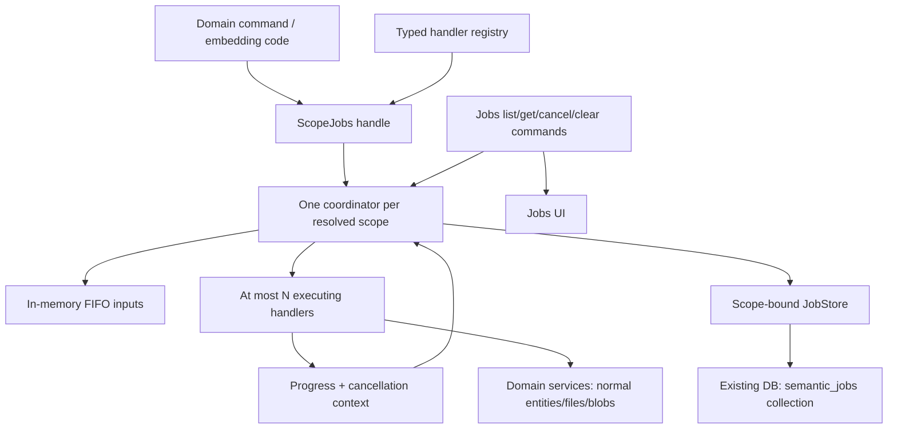
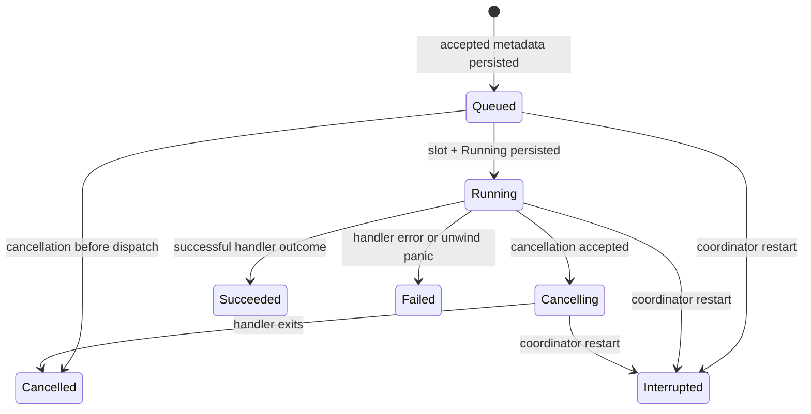

# Generic jobs system specification

Date: 2026-09-10. Status: proposed implementation specification, incorporating the project owner's completed [plugin/importer questionnaire](../2026-09-09-plugin-system/questionnaire.md). Implementation phases are in [implementation-plan.md](implementation-plan.md). This document specifies a new crate; it does not claim that the crate exists.

## 1. Product contract

`semantic_jobs`, at `crates/jobs`, runs typed asynchronous work within a Semantic scope. The application registers Rust handlers, submits runtime inputs, and observes status/progress. Importers are one consumer; media analysis, indexing, and other work can use the same runner without importer dependencies.

The binding decisions are:

- Exactly one coordinator owns a scope. It can execute several jobs concurrently. A configurable concurrent-jobs limit is the only initial execution resource policy.
- Each scope's existing database contains a dedicated jobs collection. Records contain identity/type, status, progress, simple errors, and necessary lifecycle metadata only.
- Inputs, outputs, checkpoints, stream contents, credentials, handler state, and other working data are runtime-only. The jobs collection is operational history, not a durable work queue.
- A restart cannot reconstruct unfinished work. Previously nonterminal jobs become `Interrupted`; a caller must supply inputs again to start a new job. There is no implicit retry, resume, or replay.
- Plugin implementation/configuration changes cancel affected queued/running jobs. Generic runtime cancellation groups provide this seam; `semantic_jobs` has no plugin-specific fields or types.
- Periodic threshold cleanup deletes oldest terminal records first, never active records. A command clears completed jobs, exposed in a jobs view. Cleanup does not own or delete domain entities or blobs.
- There is no initial permission/authentication machinery. Existing scope resolution still determines which scope a command addresses.

Defaults chosen for implementation, rather than new product questions: four concurrent jobs per scope; 1,000 retained job records as a soft count threshold; FIFO scheduling; one internal maintenance tick per minute. These are ordinary application settings or implementation defaults, not performance promises. The concurrency and retention thresholds are independently configurable. No queue-size, byte, file-size, deadline, bandwidth, per-kind, retry, or cancellation-grace policy is added.

The plugin [design](../2026-09-09-plugin-system/design.md) and [implementation plan](../2026-09-09-plugin-system/implementation-plan.md) must consume this specification. Historical proposals for import-owned jobs, prepared pages, receipts, persisted checkpoints, revision chains, or automatic recovery are superseded by the recorded answers. Imported entities use normal upsert/replace, while files use the existing blob store. Async import streams belong to the interface/importer implementation, not to a second jobs transport.

## 2. Existing integration points

This design relies on these inspected sources:

| Existing location | Relevant behavior and resulting seam |
|---|---|
| [Application command registration](../../../crates/app/src/command.rs) | `SemanticAppBuilder` registers commands and `RuntimePackage` schemas. Add a jobs registry/configuration and ordinary jobs commands alongside them. |
| [Application scope manager](../../../crates/app/src/scope.rs) | Scopes are lazily initialized. Its internal key includes owner and scope ID. `DbScopeId` currently lives in `semantic_app`; do not make jobs depend on app or move that type merely for this feature. |
| [Application database trait](../../../crates/app/src/db.rs) | `SemanticDb` exposes package upsert, record operations, query, and batches. Implement a scope-bound jobs store against this existing facade. |
| [Package migration operations](../../../crates/data/src/schema/migration/mod.rs) | `UpsertCollection`, `UpsertClass`, `UpsertAttribute`, and `UpsertIndex` already exist. The jobs package can provision its collection without a new database API. |
| [File package](../../../crates/data/src/filestore.rs) | Existing built-in class/attribute/migration conventions are the template for the jobs package. |
| [Public batch operations](../../../crates/data/src/query/mod.rs) | Upsert and delete are sufficient under a single coordinator. They do not provide distributed ownership or compare-and-swap. |

The [current interface research](../2026-09-09-plugin-system/research-current-interface-system.md) identifies missing callable binding/streaming integration. That work is required by plugins and importer streams, but the generic job scheduler can be implemented independently using typed Rust handlers and existing unary commands. The [entity-versioning audit](../2026-09-09-plugin-system/research-entity-versioning.md) rules out treating database revision metadata as entity history or job replay infrastructure.

Current `ScopeManager::close_scope` removes an entry synchronously; idle retirement drops its database handle without considering jobs. Introduce additive jobs-aware application lifecycle methods and an internal activity guard/check. Preserve the existing scope identity and public APIs; document the low-level synchronous close as requiring prior quiescence when a jobs runtime is attached. Do not silently allow a second coordinator after reopening an active scope.

## 3. Architecture and dependency direction



`semantic_data` owns portable jobs DTOs and the `semantic.jobs` package declaration. `semantic_jobs` depends on those DTOs and native async primitives, never on `semantic_app`, `semantic_plugin`, `semantic_import`, RPC transports, or blob stores. Application code implements `JobStore`, resolves scopes, supplies domain services, and registers commands. `semantic_import` depends on `semantic_jobs` and supplies an import handler. `semantic_plugin` may depend on jobs only for the generic group type, or its application integration can hold the groups if that keeps dependencies smaller.

The jobs crate runs on native Tokio. Browser clients consume portable DTOs and application commands; they do not instantiate the scheduler. Tokio processes and WebSocket sessions remain plugin-provider responsibilities.

Each `ScopeJobs` is constructed with one already scope-bound `Arc<dyn JobStore>`. It accepts no arbitrary collection or per-call database argument. An optional opaque scope label is for tracing only and carries no authority. The application keys its manager by the actual resolved scope identity, including the current private-owner distinction. Two aliases for one writable database must not be configured as independent coordinator owners. This is a deployment/application identity constraint, not something an in-memory map can enforce across processes.

## 4. Portable records and schema

Proposed schema names:

- Package: `semantic.jobs`.
- Collection: `semantic_jobs`, a dedicated polymorphic collection created by package migration.
- Job class: `semantic:jobs:job`.
- Attributes: `semantic:jobs:job:kind`, `status`, `progress`, `error`, `created_at`, `started_at`, `updated_at`, `finished_at`, and `snapshot_seq` under that prefix.
- Package module `v1` supplies DTOs and the eventual `Jobs` control interface. Public flat command names remain explicit adapters to those same DTOs.

The entity's existing ID is the job ID. Do not duplicate a second identity column or add domain-result relationships. Scope is implied by the bound collection/database and application scope context, so no principal or scope field is required in every job record.

API-shape pseudocode below uses full `Result<T, E>` types. Serialization derives must follow the repository's `facet`/`Value` conventions rather than introducing another wire format.

```rust
pub struct JobId(pub String); // UUID v4, encoded as an ordinary entity ID
pub struct JobKindId(pub String); // stable namespaced key, e.g. semantic.import.url

pub enum JobStatus {
    Queued,
    Running,
    Cancelling,
    Succeeded,
    Failed,
    Cancelled,
    Interrupted,
}

pub struct JobProgress {
    pub completed: u64,
    pub total: Option<u64>,
    pub unit: Option<String>, // bytes, items, steps; one counter per current phase
    pub phase: Option<String>, // short descriptive phase, not item data
}

pub struct JobError {
    pub code: String,
    pub message: String,
}

pub struct JobRecord {
    pub id: JobId,
    pub kind: JobKindId,
    pub status: JobStatus,
    pub progress: JobProgress,
    pub error: Option<JobError>,
    pub created_at: Timestamp,
    pub started_at: Option<Timestamp>,
    pub updated_at: Timestamp,
    pub finished_at: Option<Timestamp>,
    pub snapshot_seq: u64,
}
```

`Timestamp` above means the existing portable UTC datetime representation. Native scheduling uses monotonic `Instant`; wall-clock timestamps are for display/ordering. Serialize wide integers through the existing value codecs; do not cast them through JavaScript floating point in a jobs UI.

Invariants:

- Terminal statuses are `Succeeded`, `Failed`, `Cancelled`, and `Interrupted`; all are “completed” for retention and clear-completed.
- Terminal records have `finished_at`; nonterminal records do not. `started_at` is absent for jobs cancelled while queued. `created_at` never changes.
- `snapshot_seq` increases for each persisted replacement snapshot. It orders metadata writes, not attempts or entity versions. It is not a distributed fencing token.
- `Succeeded` has no error. Failure/interruption has a simple code/message. Cancellation may use the same error field to explain `user_cancelled`, `plugin_changed`, or `scope_closed`; no separate diagnostic ledger is introduced.
- Progress is an absolute latest snapshot. A phase/unit change can reset its counter; within one phase/unit the handler should report monotonically. An unknown total is `None`; a discovered/changed total may be updated, but cannot be smaller than completed. Invalid progress is rejected without failing otherwise successful work.
- There is no `Value` extension bag, serialized input/output, checkpoint, URL, output-ID list, stack trace, exception tree, plugin configuration, or blob reference in the record. Error text is stored as supplied; no special redaction pipeline is required. Handlers should still write useful concise errors rather than embedding their input documents.

The initial migration creates the attributes/types/class/collection together, and ordinary indexes on status and creation time using existing supported index operations. Kind indexing is useful for UI filtering. Current migration indexes are single-field; do not assume composite ordering/index support or uniqueness enforcement. Query on `(created_at, id)` for deterministic order, using the existing query engine and normal index/planner behavior. Backend-specific optimization is optional only after parity and measurement; correctness must work without a specialized index.

## 5. Typed handler API and runtime erasure

```rust
pub trait JobHandler: Send + Sync + 'static {
    type Input: Send + 'static;
    type Output: Send + 'static;

    fn kind(&self) -> &JobKindDescriptor;

    fn run<'a>(
        &'a self,
        input: Self::Input,
        context: JobContext,
    ) -> Pin<Box<dyn Future<Output = Result<Self::Output, JobError>> + Send + 'a>>;
}

pub struct JobKindDescriptor {
    pub id: JobKindId,
    pub title: String,
    pub description: Option<String>,
}

pub struct JobsConfig {
    pub max_concurrent_jobs: NonZeroUsize,
    pub history_threshold: NonZeroUsize,
}

impl JobsBuilder {
    pub fn register<H: JobHandler>(
        &mut self,
        handler: H,
    ) -> Result<RegisteredJob<H>, RegistrationError>;
}

impl ScopeJobs {
    pub async fn submit<H: JobHandler>(
        &self,
        registration: &RegisteredJob<H>,
        input: H::Input,
        options: SubmitOptions,
    ) -> Result<JobTicket<H::Output>, SubmitError>;

    pub async fn cancel(&self, id: JobId) -> Result<JobRecord, JobsError>;
    pub async fn clear_completed(&self) -> Result<ClearCompletedResult, JobsError>;
    pub async fn shutdown(&self) -> Result<(), JobsError>;
}

pub struct SubmitOptions {
    pub groups: Vec<JobGroup>, // runtime-only; usually empty or one plugin generation
}

pub struct JobTicket<T> {
    pub id: JobId,
    // A typed, one-shot completion receiver and latest progress receiver internally.
    // wait(self) -> Result<T, JobCompletionError>; no persistent result lookup.
}
```

Registration occurs in custom code before the registry is frozen into the application. Duplicate kind keys are errors; no silent overwrite. The registry holds immutable handler objects in `Arc`s. Handlers are reusable and may be invoked concurrently; mutable per-job state belongs in `Input`/the run future. Scope-specific dependencies are supplied as runtime input or captured by a scope-specific adapter, never found through a mutable global “current scope.”

`RegisteredJob<H>` carries the registry identity and a private erased adapter. Submission verifies that the registration belongs to this registry. Native payloads need only `Send + 'static`; they do not need `Serialize`, `Clone`, `Sync`, or `Value` conversion. This permits streams, channels, open resources, and domain service handles without making them durable job state.

Erasure is private to `registry.rs`/`runtime.rs`: package `Input` and a typed completion sender into a `Box<dyn ErasedJob + Send>`, whose adapter invokes the known `H`. If `Any` downcasts are needed, check them and produce an internal typed-registration error rather than unchecked casts or panics. Do not expose `Box<dyn Any>` to callers. A worker returns an erased outcome to the coordinator, which persists terminal metadata before releasing the typed completion result.

`JobTicket` dropping does not cancel work. It releases the caller's interest in the output. Once a handler finishes, its output is delivered once if a receiver still exists and otherwise dropped. A later `get` returns operational metadata only. Domain effects/results that must survive must already be normal domain data; the jobs crate never persists them for the handler.

Submission transfers input ownership. A definitive validation rejection never starts work. A storage error reports the generated job ID where relevant so the caller can inspect a potentially written metadata row; it must not automatically resubmit on a lost command response. There is no initial idempotency-key/retry registry. Starting again means a new job.

## 6. Scheduling, state transitions, and admission ordering

One coordinator task owns a scope's queue, live-job table, registered cancellation groups, desired metadata snapshots, and retention decisions. Worker futures run outside that task. Do not hold a synchronous lock while awaiting a database call or handler. Handler futures are not polled directly by the coordinator, so one busy handler cannot synchronously block its control loop unless it violates normal Tokio cooperation.

FIFO is the order in which the coordinator accepts submissions, independent of persisted wall-clock sorting. The queue retains inputs in memory. When a slot is free, persist `Running` before invoking the handler. Count running and cancelling worker futures toward the concurrent-jobs limit until they actually exit. Queued jobs do not consume execution slots. There are no scheduler priorities; importer selection priority chooses a handler before submission and has a different purpose.

The coordinator serializes metadata decisions for a scope. That is not a scope-wide lock around domain operations: concurrent handlers may fetch/process/write concurrently according to their domain APIs. Their transactional guarantees remain those of the existing database/domain service.



Admission sequence:

1. Check coordinator readiness, registered handler identity, and open group membership. Allocate ID and initial metadata.
2. Persist `Queued` under that ID. Only acknowledged persistence permits successful submission and later execution.
3. Retain the runtime input and enqueue. Cancellation/group invalidation ordered before dispatch prevents invocation.
4. When a slot is available, persist `Running`, set start time, and spawn the supervised handler. A durable running row followed by a crash before the first poll is correctly reported as interrupted on reopen.
5. On completion, merge the latest progress and persist one terminal snapshot. Then notify the typed ticket/subscribers and drop input/output/context resources. The execution slot is released when the worker exits, but no new execution is admitted while a required metadata write is unresolved.

Cancellation-versus-completion is determined by the coordinator's event order. If completion wins, a later cancel is an idempotent read of terminal status. If cancellation wins, the state becomes cancelling, the token is signalled, and a subsequently returned success/error is recorded as cancelled after the worker exits. Domain effects that finished before cancellation remain. A failed/panicked result after accepted cancellation may be logged, but does not turn accepted cancellation into success.

Counters/configuration should be implemented directly or with a semaphore behind this state machine. Do not reserve permits in API callers while a queued job waits, and do not spawn one waiting Tokio task per queued job. Updating the simple concurrency setting can be additive later; initial scope configuration may be fixed at coordinator creation. Raising/lowering runtime limits is not required by the first API.

## 7. Context, progress, cancellation, and panic behavior

```rust
impl JobContext {
    pub fn id(&self) -> &JobId;
    pub fn cancellation(&self) -> &CancellationToken;
    pub fn check_cancelled(&self) -> Result<(), JobError>;
    pub fn report_progress(&self, progress: JobProgress) -> Result<(), ProgressError>;
}
```

The context supplies no database, blob store, plugin registry, authorization object, or arbitrary RPC callback. The handler's typed input/captured services supply what it needs.

Use one latest-value progress cell/watch channel per live job. Replacing progress does not enqueue a database write per item. The coordinator coalesces dirty snapshots, persists them at a modest internal cadence (initially at most once per second per active job), and flushes latest progress with every status transition. This is an implementation write-coalescing strategy, not a job resource quota or a reason to reject work. Tests must use a controllable clock. Progress updates never prolong execution or create an attempt/checkpoint log.

Persisted progress is observational. It can lag live progress; it is not atomic proof that a corresponding number of domain entities committed. The importer can report committed item counts, but a crash between a domain commit and progress persistence still leaves a lag. Successful job completion means the handler reported that its domain operation finished, not that jobs state and arbitrary domain storage shared one transaction.

Cancellation is cooperative for trusted Rust handlers. Signal the cancellation token as soon as the coordinator accepts the cancellation event; persist `Cancelling` before returning a successful command response. If persistence fails, cancellation still remains requested in memory and the command reports the storage problem. Handlers check cancellation between units and use cancellation-aware waits where dropping an operation is safe. The runner does not indiscriminately drop a future that may be in the middle of a database operation.

No cancellation timeout or forced-abort grace policy is added. A noncooperative handler can remain `Cancelling` and continue occupying a slot. Scope shutdown and plugin replacement may consequently wait; the UI must show that honest state. This limitation follows the chosen initial feature scope. Async teardown of resources is owned and awaited by the handler/provider before the handler exits. RAII cleans ordinary in-memory resources. A handler must own and join/cancel child tasks; spawning detached side effects lies outside the runner's completion guarantee. `spawn_blocking` work cannot be forcibly stopped by signalling an async token.

The supervisor tracks the association between Tokio task identity and job identity even when a task panics. Under unwind builds a handler panic becomes `Failed` with code `handler_panicked` and a simple message; the coordinator and other jobs continue. There is no claim of isolation from abort builds, OOM, unsafe native code, or a process crash. A worker unexpectedly aborted by application teardown yields an interruption outcome if it can still be durably recorded; otherwise startup reconciliation handles it. No generic automatic handler retry follows either a panic or an error.

## 8. Store contract and metadata failure semantics

`JobStore` is an object-safe, scope-bound abstraction owned by the jobs crate. Its application implementation uses ordinary entity operations and package migrations. Pseudocode:

```rust
pub trait JobStore: Send + Sync + 'static {
    fn initialize<'a>(&'a self)
        -> Pin<Box<dyn Future<Output = Result<(), JobStoreError>> + Send + 'a>>;
    fn get<'a>(&'a self, id: &'a JobId)
        -> Pin<Box<dyn Future<Output = Result<Option<JobRecord>, JobStoreError>> + Send + 'a>>;
    fn put<'a>(&'a self, record: &'a JobRecord)
        -> Pin<Box<dyn Future<Output = Result<(), JobStoreError>> + Send + 'a>>;
    fn list<'a>(&'a self, query: JobListQuery)
        -> Pin<Box<dyn Future<Output = Result<JobListPage, JobStoreError>> + Send + 'a>>;
    fn count<'a>(&'a self)
        -> Pin<Box<dyn Future<Output = Result<u64, JobStoreError>> + Send + 'a>>;
    fn delete_ids<'a>(&'a self, ids: &'a [JobId])
        -> Pin<Box<dyn Future<Output = Result<u64, JobStoreError>> + Send + 'a>>;
}
```

`initialize` is single-flight per coordinator and idempotently upserts the jobs package. Use its migration to create the dedicated collection. A preexisting incompatible collection must produce a setup error, not be overwritten or silently repurposed. `JobListQuery` supplies status/kind filters, creation order, and a stable continuation cursor; its pagination serves browsing/maintenance, not job execution.

Only the owning coordinator writes/deletes jobs through supported jobs APIs. There is at most one metadata write in flight for a given scope in the initial implementation. Replacement snapshots use stable `(id, snapshot_seq)` values, so an ambiguous write result can be reconciled by reading the same ID; an exact matching snapshot means committed. An absent/older snapshot permits retrying that metadata write only after the backend's operation has settled. Never let a timed-out-but-still-running old write race a newer snapshot. No new timeout policy is needed.

`JobStoreError` must distinguish a definitive failed operation from an unknown outcome. If an adapter cannot establish that an unknown operation has settled, remain degraded rather than retrying it based only on one absent read. Track a runtime `execution_started` flag independently of persisted running status: repairing a pending running snapshot may start the original still-present input once, but can never execute it twice. Cancellation or group invalidation ordered during the outage cancels that input before dispatch.

Metadata write failure makes the coordinator `StorageUnavailable`: reject new submissions/dispatch, signal cancellation to active handlers, retain latest desired terminal snapshots and runtime completion results, and surface a service error. Existing queued inputs remain in memory while the coordinator exists and can be cancelled; nothing is silently restarted. On maintenance/recovery, reconcile and retry **metadata writes only**, in sequence. Once metadata is coherent, the coordinator can become ready again. If the host exits first, outputs/inputs are lost and restart marks stale nonterminal rows interrupted. A completion ticket must not falsely report durable success when terminal persistence failed; expose the service's degraded state and, if the service shuts down, return a storage/interruption completion error.

Progress write failures use the same degradation path; do not leave handlers producing effects indefinitely while lifecycle state cannot be stored. Logs/service health report database errors that could not themselves be persisted. A broken store may leave a stale job row; this is not repaired by fabricating success or replaying domain work.

Direct privileged writes to the jobs collection are outside this single-writer contract. With no permission system, the collection is not a security boundary. The supported jobs view is read/control only, and normal jobs commands validate allowed transitions. Future permission work must govern editing/clearing job records; it is not required to retrofit a new authorization framework now.

## 9. Startup and scope lifecycle

`ScopeJobs::open` is a readiness barrier:

1. Obtain the application's one coordinator slot for the resolved scope; initialize the package/store once.
2. Query nonterminal records in bounded internal query chunks. Mark every prior `Queued`, `Running`, and `Cancelling` row `Interrupted`, with `coordinator_restarted`, an explanatory error, and a finish time. Preserve the last recorded progress and original creation/start times.
3. Complete reconciliation before admitting submissions. Unknown historical kind keys remain listable without installing their handlers. Corrupt/unreadable records fail startup with an actionable schema error rather than being silently deleted.
4. Run threshold cleanup, then publish readiness and start maintenance.

There is no runtime payload to recover, even for queued jobs that never started. The original URL/options cannot be reconstructed from the job record. The UI offers a domain-level fresh operation when the user supplies inputs again; a generic “Resume” or “Retry” button is inappropriate. Interrupted status also acknowledges that some domain writes may already have succeeded. No rollback or cleanup of imported entities follows automatically.

The application holds a coordinator and scope/database activity guard while jobs are queued, executing, cancelling, or awaiting required metadata persistence. Idle retirement must skip such scopes. An idle coordinator may be retired only after all its runtime state is terminal and persisted. A concurrent reopen must reuse/await the existing coordinator lifecycle, not create another one.

Explicit scope close or application shutdown closes admissions, cancels queued jobs, signals running jobs, awaits worker/resource cleanup, persists terminal snapshots, stops maintenance, and then releases the database. Keep this asynchronous process outside `ScopeManager`'s synchronous locks. `ScopeJobs`/manager ownership must be acyclic: workers may hold context/service handles but not strong handles that keep their own shutdown controller alive indefinitely. If orderly shutdown cannot finish because a handler ignores cancellation or the database is unavailable, report that state. Do not silently convert it to a successful close. Process termination remains a crash for restart purposes.

## 10. Generic groups and plugin/importer integration

```rust
impl ScopeJobs {
    pub async fn create_group(&self) -> Result<JobGroup, JobsError>;
    pub async fn invalidate_group(
        &self,
        group: &JobGroup,
        reason: JobError,
    ) -> Result<GroupCancellation, JobsError>;
}
```

A `JobGroup` is an opaque scope/coordinator-bound runtime handle, not a database entity. It identifies a lifetime shared by related work. The coordinator keeps an open-group map and per-group live-job index. Closing a group removes it from admissible membership and cancels its queued/running jobs in the same serialized event. `GroupCancellation` can await all affected handler exits and persisted terminal outcomes. A group from another scope/registry or a closed group is rejected on submission. New group IDs are unique and old handles cannot recreate groups after invalidation. Remove empty closed indexes; do not retain an unbounded global tombstone history.

For each plugin activation/implementation/configuration generation, the plugin manager owns one group. Import submission captures that generation's immutable binding and group in runtime input. A change proceeds as follows:

1. Stop selecting/admitting new calls through the old activation binding.
2. Invalidate its group with `plugin_changed`. This prevents stale selections racing the change from submitting new jobs; queued inputs are cancelled without invoking the old plugin.
3. Existing import handlers observe cancellation, stop consuming new stream values and admitting new domain writes, finish any already-admitted database operation, and release streams/provider resources. Already committed entities/files remain.
4. Await affected jobs/old-instance teardown as required by the plugin lifecycle, then publish the new generation and a fresh group. The plugin manager owns process/session cleanup; jobs never kills a process or closes a WebSocket directly.

The generic runner cannot atomically cancel arbitrary external effects. Importer integration must coordinate stream consumption and its own commit-admission boundary with cancellation. A write already admitted may finish. New host writes must not start after the importer has accepted cancellation. The plugin change flow must not claim that an old remote service stopped executing merely because the local connection closed.

The built-in generic URL importer is a registered Rust plugin trait implementation whose capability uses the package importer interface. Its domain handler selects an importer, fetches/consumes an async stream, validates content, and writes ordinary entities/files through existing services. It reports operational progress through `JobContext`; it does not store URLs, prepared proposals, checkpoints, receipts, or output lists as jobs metadata. Selection priority and explicit importer choice are importer concerns. Large file bytes flow through existing streaming blob/file APIs, not progress messages or generic job records.

An integration example must include a second non-import job (a deterministic in-memory computation or existing domain adapter) using the same registration/scheduling API. This proves the crate is generic without inventing a second production subsystem.

## 11. Retention and clear-completed

The history threshold applies to the total number of job rows in one scope, including nonterminal rows. On each maintenance tick and after terminal transitions when the count is known to exceed the threshold:

1. Count current records and calculate `excess = total.saturating_sub(history_threshold)`.
2. Select terminal candidates by `(created_at ascending, id ascending)` and delete at most `excess` rows. “Oldest” means oldest creation time, not earliest finish time; the ID is the deterministic tie-breaker.
3. Recheck candidate status in coordinator/store state before deleting. Serialize deletion with lifecycle updates; exclude any record with an unpersisted desired snapshot or live worker.
4. Repeat internal chunks as needed, yielding between chunks to process control/completion events. Stop once under threshold or no completed candidates remain.

If active jobs alone exceed the threshold, all completed history may be deleted and the total may remain above threshold. Do not cancel jobs, reject submissions, or delete active rows to satisfy this history setting. The threshold is a retention target, not an admission quota. A long-running job can become the oldest eligible record immediately when it completes.

`clear_completed` selects the terminal records at its coordinator ordering point and deletes that captured set, in internal chunks. Jobs completing later are retained until a subsequent cleanup. It returns a deleted count. Repeated clearing is safe. If a storage failure interrupts clearing, report an error plus the known deleted count; deletion may have partially succeeded. Cleanup never reclassifies jobs or changes outputs. A late progress/completion event for a deleted terminal record must be ignored rather than recreating it.

Capture only candidate IDs for explicit clearing, not complete historical records or runtime results. Its snapshot may require memory proportional to completed history; normal threshold maintenance keeps only the next query chunk. Do not use wall-clock `finished_at <= now` alone to identify the captured set, because timestamp ties/clock changes can incorrectly include jobs that completed after the command.

Deleting history removes simple stored errors as well. It never removes ordinary entities, File records, or blobs, and never invokes domain rollback hooks. Job IDs therefore must not become mandatory foreign-key parents of durable imported data. A caller already holding an in-memory completion result keeps it even if history is pruned. `get` after cleanup returns not-found, not an invented terminal status.

## 12. Application commands and jobs view

Use existing application RPC registration and value codecs with these typed DTO contracts:

| Command | Input | Output/behavior |
|---|---|---|
| `semantic.jobs.list` | Scope context; optional status/kind filter; creation-order cursor | Browsable `JobListPage` of operational records. Default newest first. |
| `semantic.jobs.get` | Scope context and job ID | One current persisted record or not-found. |
| `semantic.jobs.cancel` | Scope context and job ID | Latest record after the cancellation request is durably recorded; may remain cancelling. Terminal cancellation is idempotent. |
| `semantic.jobs.clear_completed` | Scope context | Deleted count; operates only on the selected completed set. |
| `semantic.jobs.kinds` | Scope context | Registered kind descriptors; useful labels, not persisted job inputs. |

There is no generic untyped `start(kind, payload)` RPC. Each domain exposes its own validated start command and constructs the typed runtime input, then returns the job ID. This avoids turning handler registration into a second schema/permission/serialization system. Domain commands can use normal package interfaces without exposing Rust trait types across RPC.

Declare a `semantic.jobs` `v1/Jobs` package interface for the control API when the shared interface work is ready, and adapt these same methods to it. Do not block the native runner and existing unary command integration on generalized streaming. A later `watch` method can use the interface system's stream representation; polling already supports the initial view and no separate jobs WebSocket protocol is required.

The initial jobs view shows kind/title, status, current phase/counter, timestamps, and error; provides cancel on nonterminal jobs and “Clear completed”; and supports browse pagination/filtering. It treats `Cancelling` as active, `Interrupted` as terminal, and missing historical kind labels as their stored kind key. There is no persisted result explorer, detailed logs, checkpoint inspector, resume button, or retry button requiring inputs that do not exist. All current scope users may use these controls until permissions are implemented.

## 13. Performance, observability, and extension seams

Memory is proportional to queued input payloads, running handler working sets, and one latest progress snapshot per live job. The system does **not** promise globally bounded memory with an unbounded submission queue and no byte/item quotas. Handler-level async streaming avoids materializing an entire import, but does not turn the concurrent-job limit into a complete memory bound. Keep queue/input quotas and additional resource controls in future-work TODOs as requested.

Avoid one task per queued job, per-progress database writes, cloning handler inputs, loading all history for every list/cleanup, and holding registry locks over domain I/O. Persist terminal transitions promptly and batch maintenance deletes through existing database operations. Internal query chunking and progress coalescing are implementation techniques, not externally visible importer pagination or new resource-control features.

Use existing tracing conventions for job ID, stable kind, scope label, queue wait, run duration, status transitions, cancellation requested/finished, panic, store degradation, startup interruption count, and history deletion count. Never use job IDs or input URLs as metric labels. Counters/gauges can cover queued/running/cancelling jobs, terminal outcomes by registered kind, metadata-write latency, and cleanup errors. Metrics/traces are runtime observability; no detailed event log is persisted in jobs records.

Measure queue-to-start latency with trivial handlers, throughput for independent jobs at concurrency 1/4/16, metadata writes under rapid progress, and retention/list performance with representative history. Record baseline hardware/backend/toolchain; choose regression budgets after measurement. Avoid asserting fairness beyond FIFO dispatch and cooperative Tokio execution.

Future changes should fit explicit seams: durable payload/retry support as a separately designed opt-in contract, real leases/fencing for distributed coordinators, richer resources/deadlines and forced-cancellation policy, priorities/fairness, jobs permissions, event subscriptions through common interfaces, and backend index optimization. None is silently included in this first contract. Generic entity versioning belongs to the entity system and is unrelated to `snapshot_seq`.

## 14. Acceptance and failure matrix

| Scenario | Required observable result |
|---|---|
| N+1 ready jobs, limit N | Exactly N handlers run; next starts only after an executing worker exits. |
| Queued cancellation/group invalidation | Handler never invoked; queued input dropped after cancellation ordering; terminal record persists. |
| Running cooperative cancellation | Token signalled; cancelling stays active until handler cleanup/exits; cancelled persisted. |
| Noncooperative handler | Remains cancelling and consumes a slot; no fabricated forced-stop guarantee. |
| Completion races cancellation | Coordinator order selects one terminal outcome; no terminal regression. |
| Handler panic under unwind | Failed with simple error; other jobs and coordinator remain usable. |
| Caller drops ticket | Work continues; unused runtime output is eventually dropped. |
| Process restarts with queued/running/cancelling rows | All become interrupted before new admissions; no handler rerun. |
| Store loses acknowledgement after a metadata write | Read/reconcile same ID/sequence; no domain replay or stale snapshot overwrite. |
| Store unavailable during execution | Service degraded, dispatch stopped, active cancellation requested; no falsely durable success. |
| Plugin/config generation changes | Old group closes; stale selections cannot submit; affected jobs cancel. |
| Threshold exceeded solely by active jobs | No active deletion/admission rejection; threshold may remain exceeded. |
| Clear races new completion | Only terminal-at-command candidates deleted; no lost active state or record resurrection. |
| Cleanup after an import | Normal entities/files/blobs remain intact. |
| Concurrent first use/reopen/close of a scope | One coordinator and store initialization; no overlapping owners. |

These guarantees are implementation acceptance gates, not evidence of existing behavior. The [implementation plan](implementation-plan.md) assigns modules, test ownership, migration order, and review checkpoints. No remaining product question blocks this specification; subsequent questions should be raised only if implementation evidence requires changing the accepted scope or core semantics.
