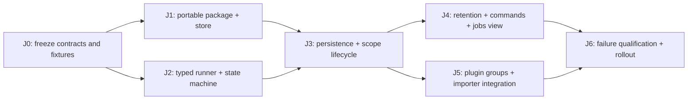

# Generic jobs implementation plan

Date: 2026-09-10. Status: proposed. Governed by [design.md](design.md) and the accepted [plugin/importer answers](../2026-09-09-plugin-system/questionnaire.md). This is implementation planning only; production code is unchanged.

## 1. Deliverables and implementation order

The first usable milestone is a native typed job handler with persisted minimal status/progress/error history, bounded concurrent execution, cancellation, and truthful restart interruption. Next add application commands/retention and the jobs view, then wire plugin generation cancellation and the URL importer. The generic runner must be demonstrably useful before importing depends on it.



`J1` and `J2` can run concurrently against a frozen in-memory `JobStore` fixture. `J4` and `J5` can run concurrently after `J3`. Plugin interface/RPC stream work proceeds independently; it gates the actual importer integration, not the scheduler foundations. Align the plugin plan's importer milestone with `J3`/`J5`; do not implement a second scheduler while waiting.

Use an orchestrator and up to three bounded workstreams as agent capacity permits. One agent owns shared `Cargo.toml`, crate exports, public DTO/trait changes, and app-builder wiring per phase. Shared contracts are frozen at phase boundaries, and ownership of overlapping files is explicit. A review agent receives concrete changes and acceptance evidence rather than an unbounded invitation to redesign.

Every task packet includes: specification sections; exact owned paths; public API/schema fixture revision; dependencies; non-goals; tests/commands; and required handoff notes. Agents must preserve unrelated work, use full `Result<T, E>` types, and stop before aggressive core behavior/type changes. Any new distributed lock, payload persistence, resource quota, permission framework, importer-specific table, or automatic retry requires a separate design decision.

## 2. Proposed crate and module layout

| Location | Owner/responsibility |
|---|---|
| `crates/data/src/jobs.rs` | Portable DTOs, package/class/attribute IDs, schema builder and migration. |
| `crates/jobs/src/lib.rs` | Deliberate small public surface and documentation. |
| `crates/jobs/src/config.rs` | Concurrent-jobs setting and history threshold validation/defaults. |
| `crates/jobs/src/handler.rs` | Typed handler/registration/ticket contracts; private erasure adapter. |
| `crates/jobs/src/registry.rs` | Immutable handler registry, duplicate/foreign-registration checks. |
| `crates/jobs/src/context.rs` | Cancellation and latest-value progress API. |
| `crates/jobs/src/coordinator.rs` | Sole metadata/queue/state/group owner; admission and control ordering. |
| `crates/jobs/src/runtime.rs` | Worker supervision, task/job association, erased outcomes, ticket delivery. |
| `crates/jobs/src/group.rs` | Opaque scope-bound group handles and invalidation completion. |
| `crates/jobs/src/store.rs` | Object-safe scope-bound persistence trait and list/filter DTOs. |
| `crates/jobs/src/recovery.rs` | Nonterminal-to-interrupted startup reconciliation; metadata repair. |
| `crates/jobs/src/retention.rs` | Terminal candidate ordering and threshold/clear algorithms. |
| `crates/jobs/src/error.rs` | Stable registration/submission/store/control/completion errors. |
| `crates/jobs/tests/` | Deterministic scheduler/failure/integration tests using injectable clock/store. |
| `crates/app/src/jobs/{mod,store,command}.rs` | Scope manager, `SemanticDb` store adapter, RPC control adapters. |
| Existing app builder/scope files | Additive ownership/readiness/activity/shutdown integration, single owner. |
| Existing UI/CLI/SDK locations | Jobs view, CLI controls, generated portable bindings; locate nearest existing conventions before editing. |

Initial dependencies: `semantic_data`, Tokio native runtime/sync/time, cancellation support (`tokio-util` if consistent with workspace use), and the existing project's error/ID helpers or a private UUID generator. Tests may use existing database fixtures. Do not require `semantic_import`, plugins, RPC transports, file/blob libraries, or `SemanticApp` in the jobs crate. Keep native runtime dependencies out of portable data/browser builds.

These paths are proposed creation targets, not assertions that files exist. The integration owner can merge a tiny module where clearer, but must preserve responsibility boundaries and avoid a monolithic coordinator with all persistence/UI/domain logic.

## 3. J0 — Freeze contracts and feasibility fixtures

Dependencies: accepted questionnaire and this specification. Output: implementation packets and small golden fixtures; no new product questionnaire is needed.

Tasks:

1. Freeze `JobRecord`, status values, progress/error shape, `JobHandler`, `RegisteredJob`, `JobTicket`, `JobContext`, `JobStore`, and `JobGroup` contracts from design sections 4–10.
2. Freeze defaults: four concurrent jobs per scope, history threshold 1,000, FIFO, oldest by creation time then ID, terminal-at-command clear semantics. Maintenance cadence/progress coalescing remain implementation details and not user resource policies.
3. Capture schema/DTO fixture examples for queued/running/cancelled/interrupted/succeeded/failed jobs, unknown kind keys, and wide integer progress. Ensure none contains payload/checkpoint/result data.
4. Confirm existing package migration can provision `semantic_jobs` via `UpsertCollection`; use existing collection/class/index conventions. Verify app store adapter can operate through `SemanticDb` without a new core trait method.
5. Locate existing app/CLI/UI lifecycle hooks and record the additive integration patch shape. Preserve `DbScopeId` in app; keep coordinator identity derived from resolved scope, including owner where applicable.
6. Define a deterministic in-memory store with fault points, a test clock, and controlled handlers (gated start/finish, cooperative cancellation, unwind panic). Publish these shared fixtures before worker agents diverge.

Parallel assignment: contract/integration owner; schema/store feasibility owner; runtime-fixture owner. Only the contract owner edits shared public types. No independent redesign of status/cancellation semantics by transport/import agents.

Acceptance gate: dependency graph is acyclic; runtime payloads have no serialization bound; no persistent resume semantics remain; schema names and snapshots are stable; existing APIs suffice or an explicitly additive adapter change is documented. A need to change core transaction/identity semantics blocks that particular workstream and is escalated, not hidden.

## 4. J1 — Portable package and database store

Dependencies: J0. Can run alongside J2.

Owned paths: `crates/data/src/jobs.rs`, designated shared exports through integrator, `crates/jobs/src/store.rs`, `crates/app/src/jobs/store.rs`, backend parity tests.

Tasks:

- Implement portable DTOs/status validation and `semantic.jobs` package with an immutable `001_init` migration creating attributes/types/class and dedicated polymorphic `semantic_jobs` collection.
- Add supported single-field status/creation/kind indexes. Do not assume a composite index API or use index uniqueness as coordinator ownership.
- Implement idempotent initialization through `SemanticDb::upsert_package`; reject incompatible preexisting collection/schema. Keep the existing default entity collection unchanged.
- Implement get/put/list/count/delete-ID operations with existing `Value`/entity/query/batch conversions. Validate decoded rows and return structured store errors. No backend-specific storage format or SQL string interpolation of identifiers/input.
- Define deterministic browse ordering/cursors and terminal filters; build maintenance selection from the same query path. Large internal deletes are chunked through current batch operations.
- Provide store parity tests using the project's embedded and available PostgreSQL test paths. Lack of backend MVCC must not invalidate this single-coordinator design.

Tests: migration replay/reopen, exact schema field allowlist, required timestamps by status, wide integers, collection separation, absent/unknown kind ID, corrupt record error, upsert/get roundtrip, creation/id tie ordering, list cursors, terminal-only selection, repeated deletion, status/creation index behavior, incompatible collection initialization. Assert no job output/input/URL/blob data is persisted.

Acceptance: stores use only existing DB capabilities; migration is repeatable; history survives reopen; job data is separate from normal domain collection; no new jobs blob store or backend is introduced. Schema/codec tests pass on the intended supported implementations.

## 5. J2 — Typed native runner and control state machine

Dependencies: J0 fixtures/contracts. Can run alongside J1 with an in-memory store.

Workstreams:

| Agent | Owns | Required handoff |
|---|---|---|
| Typed API owner | `handler`, `registry`, `context`, private erasure and ticket handling | Registration/type/ownership tests and public example. |
| Coordinator owner | `coordinator`, `runtime`, status scheduling, cancellation/panic ordering | Transition table, deterministic race tests, concurrency proof fixture. |
| Group/test owner | `group`, group index/invalidations and stress fixtures | Stale-group/scope isolation tests against frozen coordinator messages. |

Tasks:

- Register handlers with unique stable kind IDs and return typed handles; freeze immutable registry. Reject foreign-registry handles and checked erasure mismatches.
- Keep inputs in an in-memory FIFO and invoke only after queued/running snapshots are acknowledged. Spawn only executing workers, not one wait task per queued job.
- Enforce concurrent-jobs limit; cancelling workers consume slots until exit. Release inputs/output senders deterministically on cancellation/finish/caller drop.
- Implement absolute progress snapshots with latest-value coalescing, validation, and terminal flush. Never enqueue one durable event per report.
- Implement cancellation/completion event ordering and honest cancelling state; no timeout/grace/automatic abort/retry policy. Supervise panic outcomes without losing task-to-job association.
- Implement scope-bound groups, atomic closed-group admission rejection and affected-job cancellation; retire empty indexes without tombstone growth.
- Produce a complete embedding example registering an ordinary non-import handler with a non-serializable input and typed output.

Tests: limit 1/N and N+1 jobs; FIFO; queued jobs do not spawn handlers; queued/running cancellation; cancel/completion orders; noncooperative handler remains cancelling; panic isolation; caller-drop continuation; runtime output delivery/drop; non-Clone/non-Serialize input; foreign registration/group; stale group selection racing invalidation; multiple groups; progress phase changes/invalid totals/coalescing; no terminal resurrection.

Acceptance: handler code executes outside coordinator/synchronous locks; jobs crate has no app/plugin/import dependency; one active worker slot corresponds to one live handler; grouped cancellation cannot admit stale work. Memory accounting explicitly includes unbounded queued payloads and does not claim a hard memory guarantee.

## 6. J3 — Persistent lifecycle and one coordinator per scope

Dependencies: J1 and J2. Output: first usable generic jobs service integrated into a Semantic scope.

Owned paths: recovery/persistence integration in jobs; app jobs manager and builder wiring; additive scope lifecycle hooks. One integration owner coordinates existing app files.

Tasks:

- Initialize store and reconcile every stale nonterminal row to interrupted before publishing readiness. No input replay or automatic handler invocation on restart.
- Implement monotonic full-snapshot writes, exact read reconciliation for lost acknowledgements, definitive-versus-unknown store errors, and metadata-only retry. Do not permit an old uncertain write to race a newer one or start a handler twice after repairing a running snapshot.
- Implement storage-degraded service state: stop dispatch/submission, signal active cancellation, retain pending desired snapshots/results in memory, and repair metadata on maintenance/recovery.
- Deliver typed completion only after terminal metadata is persisted; surface storage/interruption failure on shutdown if it cannot be persisted.
- Add manager single-flight initialization keyed by resolved scope identity. Hold an activity guard while queued/live/pending-persistence work exists; idle retirement and close must not open a second owner.
- Add orderly asynchronous scope/application shutdown before underlying scope removal. Await handler/provider cleanup without a synchronous lock. Preserve honest failure/hang states for unavailable storage/noncooperative handlers.
- Register jobs schema/configuration through the app builder while preserving existing package/command behavior and explicit/default-scope initialization conventions.

Failure tests: crash after queued write/before dispatch; after running write/before first poll; after domain side effect/before terminal metadata; terminal write succeeds but acknowledgement lost; progress write failure; storage recovery; pending typed output during store failure; stale progress after terminal; startup schema/corrupt-row failure; concurrent first access; private scopes sharing displayed IDs; close/reopen races; idle retirement while queued/running/cancelling; coordinator-drop/task ownership leaks.

Acceptance: old work is interrupted without execution; completion never falsely reports persisted success; coordinator ownership is single-flight in the application; explicit single-process-per-scope deployment limit is documented. No distributed leases or changes to core entity types have appeared.

Freeze J3 API before dependent importer work: submission/ticket/context/group/store/lifecycle behavior and the application lookup entry point. A generic in-process example must run against the actual DB store, report progress, cancel, restart/reconcile, and return a typed ephemeral output.

## 7. J4 — Retention, commands, and jobs view

Dependencies: J3. Can run alongside J5.

Workstreams: retention/store-control owner; app/CLI/SDK command owner; UI owner. App shared registration/export files belong to the integrator. UI owner locates established component/navigation patterns instead of redesigning unrelated screens.

Tasks:

- Implement periodic soft-threshold cleanup of oldest terminal records, stable creation/id order, active/live/dirty exclusion, and yielding between internal chunks.
- Implement clear-completed's captured terminal candidate set, deleted count, partial-failure response, and idempotency. Suppress late events instead of recreating deleted jobs.
- Register `semantic.jobs.list/get/cancel/clear_completed/kinds` using current RPC codecs. Domain commands remain responsible for typed submission; no generic serialized start command.
- Add the jobs package control interface/adapter when the shared interface foundation is available, preserving the same DTOs and command behavior. Do not create a jobs-specific streaming transport.
- Add a jobs view with list/filter/browse pagination, phase/progress/status/error, cancel, and clear completed. Use polling initially; portable client build requires no native jobs runtime dependency.
- Add CLI list/get/cancel/clear controls following existing command conventions and export SDK DTOs as appropriate.

Tests: threshold below active count; oldest job completing late; tied creation times; active/queued/cancelling protection; threshold update on next startup; clear racing completion/submission; late progress after deletion; cleanup partial failure/repeat; retained typed ticket result after record deletion; unknown historical kind label; UI interrupted/cancelling states; wide integer rendering; scope routing; no generic retry/resume offered.

Acceptance: cleanup never invokes domain deletion; all completed statuses are eligible; active rows survive under pressure; jobs UI clear command is wired end-to-end; every scope user currently has access through ordinary scope resolution. TODO permission work is linked without introducing a permission framework.

## 8. J5 — Plugin lifetimes and streamed importer integration

Dependencies: J3 plus the plugin plan's Rust registration/interface/importer foundations. Native generic-group tests do not depend on external transports. Coordinate the actual URL importer/file stream milestone with the revised [plugin implementation plan](../2026-09-09-plugin-system/implementation-plan.md).

Owned paths: plugin/app activation integration, importer handler adapter, domain integration tests. The jobs API owner reviews any requested generic API additions; domain agents must not add importer fields to jobs DTOs.

Tasks:

- Allocate one group per scope/plugin implementation/config generation. Capture binding and group at importer selection; submit the typed handler input with the group.
- Implement stop-old-admissions, invalidate group, cancel queued/running work, await required cleanup, and create/publish new group. Stale selected bindings must fail submission.
- Wrap import execution as a generic handler that consumes interface async streams and reports progress. Source request/options/binding/streams/working data remain in memory.
- Make the importer own its cancellation/commit admission boundary, with already-admitted DB operations allowed to finish and no new work admitted after cancellation. Persist normal entity upserts and existing File/blob data only.
- Expose an importer-specific start command returning a job ID and let the generic jobs view display it. Give the builtin generic URL Rust plugin low selection priority, with explicit user choice handled by importer discovery, not by the scheduler.
- Demonstrate plugin change cancellation for queued and running URL imports with a deterministic local HTTP fixture. External stdio/WS adapters later run the same handler contract and group tests.

Tests: source selection/config update race; old generation queued job never starts; new generation runs only with fresh group; cancellation mid-byte stream; File/entity commit already admitted during cancel; restart leaves normal data intact and jobs interrupted; cleanup removes job only; no version chain/receipt/checkpoint entities; no input URL/output data in job record. Run the independent non-import job alongside import jobs under one shared concurrency limit.

Acceptance: importer has no bespoke scheduler; changing a plugin cancels affected jobs and cannot mutate existing queued inputs to use new code/config; async streams are not materialized into jobs persistence; existing DB/blob APIs remain the only domain storage. A cancelled job is not claimed to roll back already committed output.

## 9. J6 — Qualification, migrations, and rollout

Dependencies: J4 and J5. Output: tested release behavior, small runbook, and measured baseline.

Independent review workstreams:

- State/fault review: full transition/race/fault matrix, panic and lost-store-response behavior, restart with no payload, no terminal resurrection, group invalidation ordering.
- Scope/store review: actual backend parity, schema replay, close/idle ownership, threshold cleanup safety, no authorization/scope identity regression, all writes through one coordinator.
- Performance/product review: progress-write coalescing, FIFO/concurrency behavior, memory explanation, jobs UI/CLI, unknown kind history, user-facing cancellation/interruption errors.

Measure trivial-handler queue latency, concurrent throughput, metadata writes under rapid reports, and list/cleanup behavior with representative history. Use deterministic input sizes and record actual memory growth with queued payloads; do not assert bounded memory from concurrency alone. Tests use controllable clocks and barriers rather than wall-clock sleeps. Repeat broad checks only after relevant changes/failures.

Rollout:

1. Add the new package/migration and registry to an explicitly configured development application. Existing applications without jobs initialization continue normally.
2. Initialize an empty jobs collection; run the generic non-import example and verify persisted schema/records, cancellation, clear, and restart interruption.
3. Enable the jobs view/commands and verify retention behavior before connecting importers. Make the operational limitation visible: restart loses runtime inputs and cannot resume.
4. Enable the builtin URL Rust plugin/import handler in a development scope, then qualify stdio/WS through the plugin plan as available.
5. Widen use after per-backend/restart/group tests pass. Ensure deployments designate one coordinator per writable scope; no active-active server support is implied.

There is no existing current-project jobs collection to migrate from. Historical repositories' import jobs are not silently imported or treated as compatible. Future jobs schema changes use additive package migrations; never edit `001_init` after release. Code downgrade must leave records intact and refuse incompatible schemas rather than dropping history. Disabling jobs retains its schema/history and all domain data; normal retention/clear acts only when explicitly invoked by the service/user.

Runbook covers storage unavailable, indefinitely cancelling trusted handler, interrupted after restart, stale/unknown kind records, history already pruned, incompatible jobs collection, and overlapping coordinator configuration. It must not suggest restoring work from nonexistent payloads or checkpoints. Lost metadata does not justify automatic domain replay.

Release acceptance: implementation satisfies every design section 14 case; docs/UI agree on minimal data and interruption; independent non-import and URL import handlers share the runner; no new resource policies or Wasmer dependencies appeared; all required validation passes.

## 10. Required verification and phase handoff

Follow repository [AGENTS.md](../../../AGENTS.md). When Nix is available, checks/tests run through its devshell. Inspect the existing flake for its actual default shell rather than inventing a profile. Standard commands, narrowed to actual changed crates/features where useful:

```bash
nix develop --command cargo check --quiet --message-format=short
nix develop --command cargo test --quiet --message-format=short
nix develop --command cargo fmt
```

Use `-p semantic_jobs` for the new crate and appropriate actual data/app/UI/backend package names for targeted checks. Run relevant integration/default-workspace checks at completion. Full `cargo check --quiet` or `cargo test --quiet` is only for cases where short output is insufficient. If Nix is unavailable, use direct Cargo and report that fact. `cargo fmt` follows final implementation edits; preserve unrelated work.

The planning artifacts themselves require link, fence, whitespace, and decision-consistency review. They do not establish implementation gates or justify claiming unrun Rust tests passed.

Each phase handoff includes changed files, frozen API/schema revisions, fulfilled acceptance cases, exact commands/results, compatibility/ownership assumptions, and any remaining specific blockers. The orchestrator reconciles plugin/jobs cross-links and prevents duplicate ownership of common app/Cargo files.

No additional questionnaire is needed now. Defaults and known limitations are explicitly specified above; only concrete implementation evidence requiring a materially different behavior should reopen a product decision.
