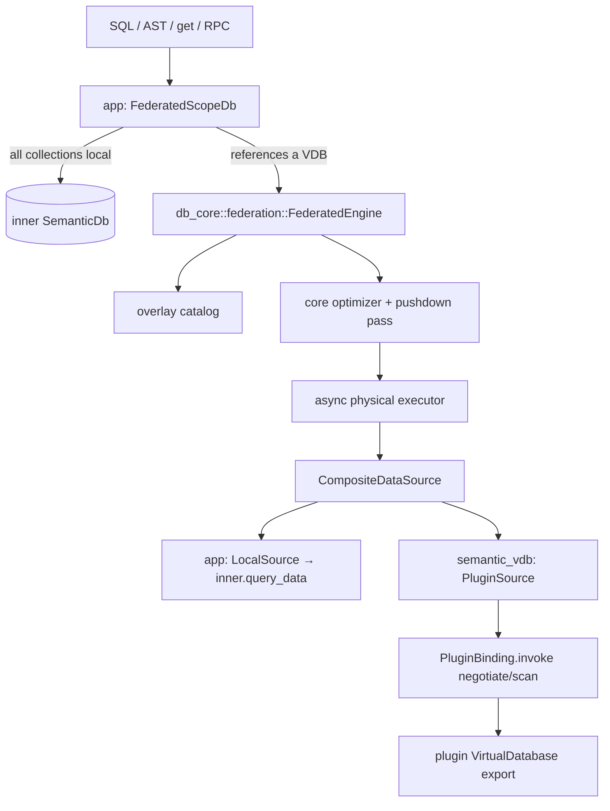

# Plugin virtual databases: design and implementation plan

Created: 2026-10-03. Status: proposed. Audience: implementers (junior to mid
level) and the orchestrating agent.

Plugins can already export `semantic.import/v1` `Source`/`Fetcher`/`Importer`
implementations ([plugin system design](../2026-09-09-plugin-system/design.md)).
This plan adds a fourth capability: a plugin can export a **virtual database**
(VDB). The host exposes it as a read-only, polymorphic entity collection. It can
be queried through SQL, the query AST and collection-addressed APIs, and it can
be joined and mixed with local collections and other VDBs. Plugins answer
simple scans. The host's query engine does everything the plugin cannot.

How to read this document:

- §1–§5 define **what** to build and the rules that must hold. Read them before
  any task.
- §6 is the **task-by-task implementation plan**. Each task lists files, steps,
  tests and a definition of done.
- §7 is the **subagent execution plan**: ordering, parallelism, briefs and
  commit rules.
- §8 is a glossary. Look terms up there when they're unfamiliar.

## Progress checklist

Update this list as tasks land (one commit per task, see §7).

- [x] S1 S2 S3: spikes (notes only)
- [x] T1.1: `semantic.vdb` package and DTOs (`crates/data`)
- [ ] T1.2: register the package in the app
- [ ] T2.1: federation module split, `QuerySource` trait, referenced collections
- [ ] T2.2: overlay catalog and planning
- [ ] T2.3: pushdown pass and negotiation
- [ ] T2.4: composite data source, execution, explain
- [ ] T2.5: port the legacy `FederatedBackend` onto the engine
- [ ] T3.1: `semantic_vdb` crate, plugin-author trait, plugin adapter
- [ ] T3.2: `PluginSource` (binding → `QuerySource`)
- [ ] T3.3: `ScopeVdbs` (naming, conflicts, runtime schema cache)
- [ ] T3.4: fixture VDB plugin for tests
- [ ] T4.1: `LocalSource`, `FederatedScopeDb`, routing
- [ ] T4.2: `semantic.vdb.list` / `semantic.vdb.explain` commands
- [ ] T4.3: app integration test suite and differential oracle
- [ ] T5.1: bind joins: parameterized negotiation and synthetic indexes
- [ ] T5.2: batched index nested loop (**gated: user review first**)
- [ ] T6.1: example JSON-directory VDB plugin
- [ ] T6.2: CLI rendering, UI surfacing
- [ ] T6.3: documentation

## 1. Decisions

| Topic | Decision |
|---|---|
| Granularity | One VDB = one **polymorphic collection**. There are no per-table names. For example, a GitHub VDB exposes orgs, users, repos, issues and PRs as entities of different classes in one collection, and users select resources with `WHERE type = 'github:Issue'`. |
| Row model | Every row is an **entity**: string `id`, optional `type` (class id), attributes. Class instances key attributes by qualified attribute ids, exactly like local DB results. Plain/untyped entities are allowed if the VDB declares so. The host validates entities. |
| Schema exposure | **Runtime-only, explicitly exposed definitions; no migrations, nothing persisted.** `describe` returns a `DatabaseSchema`: exactly the `TypeDef`s, `AttributeType`s, `ClassType`s and `RelationType`s that the VDB collection exposes. These are the **existing** schema types (`semantic:schema:*`, already published by the `semantic.query` bundle). Nothing else the plugin uses internally (interface DTOs, config types, helper records) is part of it. The host keeps the schema in memory per plugin generation and refreshes it when the plugin reports a new `schema_revision`. At query time it is applied to the in-memory overlay catalog with the **existing** pure DDL function `ddl::apply_ddl_batch`, as `DdlOperation::Upsert*` operations. It never reaches the persisted scope catalog. Clients read it through `semantic.vdb.schema`. |
| Writes | **Read-only in v1.** INSERT/UPDATE/DELETE/batches/DDL that target a VDB fail with a clear error. The interface keeps room for write methods later. |
| Pushdown contract | **Per-query negotiation.** For every query leaf, the host offers a candidate scan (filter conjuncts as `semantic.query` `Expr`, order, limit/offset, projection hint). The plugin answers per conjunct with `exact` / `inexact` / `unsupported`, how much ordering it guarantees, and whether it applied limit/offset. It can also reject the scan with a reason. There is no capability description language. |
| Addressing (default, see open question 1) | Collection name = plugin **activation id** (unique per scope, chosen at install). A plugin with several `VirtualDatabase` exports gets `<activation_id>.<export>`. SQL: `FROM github`; AST: `SelectQuery.collection = Some("github")`; `get("github", id)`. A clash with a local collection makes the VDB unavailable, with a diagnostic. It never shadows local data. |
| Catalog | `SemanticDb::catalog()` keeps returning the **local** catalog unchanged. VDBs are listed by a new `semantic.vdb.list` command. Nothing that persists or migrates schema ever sees VDB collections. |
| Layering | The local DB engine is **not changed** to know about plugins. A federation engine in `db_core` plans mixed queries with the existing optimizer over an in-memory overlay catalog. It runs them with the existing async executor through a composite data source. The local DB participates as one more `QuerySource`. Queries that reference no VDB pass through unchanged (fast path). |
| Plugin activation | Plugins are activated lazily. A local-only query never starts plugins. Plugins are resolved only when a query references a collection that doesn't exist locally. |

## 2. Current state (evidence)

All of these were verified in the code on 2026-10-03.

| Area | Finding | Consequence |
|---|---|---|
| `crates/db_core/src/federation.rs` (1795 lines, unused outside db_core) | `FederatedBackend` contains: a `FederatedSource` trait (`catalog`/`scan`/writes), `SourceRegistry`, dotted names via `split_source_collection`, `resolve_logical_sources` (tags `SourceRef.backend_tag`), `FederatedAsyncPhysicalDataSource`, `chunk_federated_rows`, and its own tests from line 1190. Pushdown is only boolean `SourceCapabilities`. | Reuse its helpers. Build the new engine next to it and port it at the end (T2.5). |
| `crates/db_core/src/plan/execute.rs` | Async executor: `AsyncPhysicalDataSource` (`scan_stream`, `scan_filtered_stream`, `index_lookup_stream`, …), `execute_physical_plan_collect(plan, Arc<dyn AsyncPhysicalDataSource>, QueryContext, ExecutionOptions)`. Embedded queries drive it synchronously in a `LocalPool` (`embedded/db/reader.rs::execute_physical_plan_with_metrics`). | Federated execution calls `execute_physical_plan_collect` on tokio. Local leaves go through the async `SemanticDb::query_data`, never through the `LocalPool` path. |
| `crates/db_core/src/plan/optimizer.rs` | `Optimizer::core()`, `optimize_query_with_source(&SelectQuery, SourceRef, stats, &QueryContext) -> PlanPair`, `lower_to_physical`. Filter pushdown sets `LogicalPlan::Source.pushed_predicate`. Lowering picks index access paths / `IndexNestedLoop` from **catalog indexes** (`choose_scan_source`, `choose_index_join_probe`). | The overlay catalog must not expose local indexes to the federation planner (S2 decides how). Otherwise lowering emits index nodes that the composite source cannot serve. |
| `crates/db_core/src/canonical.rs` | `canonicalize_select_query(&SelectQuery, &Catalog, &CollectionSchema)` resolves names to qualified attribute ids, including joins. | Canonicalize against the overlay catalog. |
| `crates/db_core/src/query.rs` | Core query types mirror the public ones, with `From` conversions in **both** directions: `From<public::Expr> for Expr` (l.486), `From<Expr> for public::Expr` (l.759), same for `SelectQuery` (l.658/929). `evaluate_filter_expr(row, &Expr)` (l.2085). `into_bound(params)` binds parameters. | The engine works on core types internally and converts filters to public `Expr` for `ScanRequest`. |
| `crates/db_core/src/plan/index_access.rs:428` | Private `fn conjuncts(Expr) -> Vec<Expr>`. | Make it `pub(crate)` and reuse it. Don't write a second one. |
| `crates/db_core/src/query/sql/enabled.rs` | `FROM a.b` becomes collection `"a.b"`. UNION/set operations are unsupported. | VDB names need no parser change. UNION is a follow-up. |
| `crates/data/src/bundles/query` | The `semantic.query` package publishes the query AST as named schema types. `query::Expr: SemanticType + IntoValue + FromValue` (named type `semantic:query:Expr`). It is installed in every scope (`crates/app/src/command.rs` `build()`). | `ScanRequest` can hold `Vec<semantic_data::query::Expr>` directly. |
| `crates/macros` | Derives: records, unit enums, **tagged enums with struct variants** (`#[semantic(tag = "...")]`), `Option` and `default` fields. | DTOs use derives (see `crates/data/src/jobs.rs`), not hand-written codecs like `import.rs`. |
| `crates/data/src/import.rs` `package()` | Pattern for a built-in interface package: interfaces in the `v1` root module, async methods throwing `{code, message}`, `Stream` results. | `semantic.vdb` follows it. |
| `crates/import/src/url.rs`, `lib.rs` | Pattern for a Rust plugin: `Plugin` + `InterfaceImplementation::invoke` matching `call.method`, `InvocationOutput::Values/Stream`, `OwnedValueStream`/`StreamEvent::{Item, End}`, `PluginBinding::invoke(method, args)`. | The VDB adapter copies these patterns. |
| `crates/app/src/command.rs` `build()` | Built-in plugins get `ImplementationDescriptor`s with fingerprints via `catalog.resolve_interface(...)`. Packages are pushed into `self.packages`. | T1.2/T3.1 follow the same steps. |
| `crates/app/src/context.rs::resolve_db`, `scope.rs::resolve_scope` | Commands get `Arc<dyn SemanticDb>` per scope. Plugins are opened lazily via `SemanticApp::plugins(principal, scope_id)` and persist through the **inner** db. | Wrap in `resolve_db` (T4.1). Plugin persistence keeps using the inner DB, so there is no cycle. |
| `crates/app/src/db.rs` | `SemanticDb` has ~25 methods, many with default impls. There is no `explain` method. | The wrapper must forward **every** method explicitly (T4.1 pitfall). |
| `crates/app/tests/imports.rs` | Harness: `SemanticApp::builder().with_default_scope(..).register_plugin(..)`. Registered Rust plugins auto-activate with activation id = manifest id. Cloning an activation with a new id and calling `plugins.configure(..)` creates a second activation. | Reuse it for VDB tests, including two activations of one plugin. |
| `crates/data/src/query/semantic/schema.rs` | `schema::TypeDef`, `AttributeType`, `ClassType`, `RelationType`, `RecordType` (and everything they reference) implement `SemanticType`/`IntoValue`/`FromValue` as named types `semantic:schema:*`, published by the `semantic.query` bundle installed in every scope. `Module`/`Package` do **not**. | The VDB schema is a record of lists of these existing types. Plugins and RPC clients can use them as ordinary values; no document encoding and no new schema format is needed. |
| `crates/db_core/src/ddl.rs` | `pub fn apply_ddl_batch(catalog: &Catalog, batch: &DdlBatch) -> Result<(Catalog, DdlOutcome), CoreError>` is **pure**: it validates (including computed attributes) and returns a new catalog. `DdlBatch`/`DdlOperation` are the public `semantic_data::query` types (`UpsertTypeDef`, `UpsertAttribute`, `UpsertClass`, `UpsertRelationship`, …). Persistence and migrations are separate (`managed_schema.rs`, `Backend::execute_ddl`). | Overlay = `apply_ddl_batch(local_catalog_clone, vdb_schema_as_upserts)`. Runtime definitions reuse the exact lowering/validation that persisted DDL uses, with no persistence and no migrations. |
| `flake.nix` | A nix devshell exists. | Run all cargo commands as `nix develop -c cargo …`. |

## 3. Architecture



| Location | Responsibility |
|---|---|
| `crates/data/src/vdb.rs` (new) | `semantic.vdb` package: `VirtualDatabase` interface and typed DTOs with derives, plus `AcceptedScan::validate`. |
| `crates/db_core/src/federation/` (split of `federation.rs`) | `QuerySource` trait, `FederatedEngine` (overlay, canonicalize, optimize, pushdown, composite execution, explain), `referenced_collections`. No plugin/rpc/app dependency. |
| `crates/vdb` (new crate `semantic_vdb`) | Plugin-author trait + `Plugin` adapter, `PluginSource` (binding → `QuerySource`), `ScopeVdbs` (naming/conflicts/describe cache), entity validation, fixture plugin behind feature `testing`. Depends on data, db_core, plugin, rpc, rpc_core. Not on app. |
| `crates/app` | `LocalSource`, `FederatedScopeDb`, routing, read-only enforcement, `semantic.vdb.*` commands. |

Dependency rule: `data ← db_core ← vdb ← app`, and `plugin/rpc ← vdb`. db_core must never depend on plugin or rpc.

## 4. Interface contract: `semantic.vdb/v1`

### 4.1 Methods

Interface `VirtualDatabase`. All methods are async and throw `VdbError { code, message }`.

| Method | Params | Result |
|---|---|---|
| `describe` | none | `DatabaseDescriptor` |
| `negotiate` | `request: ScanRequest` | `ScanPlan` |
| `scan` | `request: ScanRequest`, `plan: AcceptedScan`, `bindings: Record<String, Any>` | `Stream<Entity, ScanSummary>` |

### 4.2 Rust DTOs (`crates/data/src/vdb.rs`)

Use the derive pattern from `crates/data/src/jobs.rs`. The shape below is the
contract. Exact attribute syntax follows the macro docs in
`crates/macros/src/lib.rs`.

```rust
pub const PACKAGE_NAME: &str = "semantic.vdb";
pub const MODULE_NAME: &str = "v1";
pub const INTERFACE_NAME: &str = "VirtualDatabase";

/// Static metadata, cached per plugin generation and schema revision.
pub struct DatabaseDescriptor {
    pub title: String,
    pub description: Option<String>,
    /// Everything this VDB exposes through the database, and nothing else (§4.5).
    pub schema: DatabaseSchema,
    /// Opaque; changes whenever `schema` changes. Echoed in `AcceptedScan`.
    pub schema_revision: String,
    /// Whether entities without `type` may be emitted.
    #[semantic(default)]
    pub allow_untyped: bool,
}

/// The definitions exposed through the VDB collection. Element types are the
/// existing `semantic_data::schema` types; there is no VDB-specific format.
pub struct DatabaseSchema {
    #[semantic(default)]
    pub types: Vec<schema::TypeDef>,
    #[semantic(default)]
    pub attributes: Vec<schema::AttributeType>,
    /// Entities emitted with a `type` must use one of these classes.
    #[semantic(default)]
    pub classes: Vec<schema::ClassType>,
    #[semantic(default)]
    pub relationships: Vec<schema::RelationType>,
}

impl DatabaseSchema {
    /// Lower to upsert-only DDL (types, attributes, classes, relationships, in
    /// that order) for `ddl::apply_ddl_batch`.
    pub fn to_ddl_batch(&self) -> query::DdlBatch;
    pub fn class_ids(&self) -> impl Iterator<Item = &str>;
}

#[semantic(rename_all = "snake_case")]
pub enum FilterSupport { Exact, Inexact, Unsupported }

pub struct ScanRequest {
    /// Conjuncts (AND-ed). Field paths are entity-relative (no join alias)
    /// and canonical: qualified attribute ids, plain `id`/`type`.
    /// Literals are bound; `Operand::Parameter` appears only for names listed
    /// in `parameters`.
    pub filters: Vec<query::Expr>,
    pub order_by: Vec<query::OrderBy>,
    pub limit: Option<u64>,
    #[semantic(default)]
    pub offset: u64,
    /// Attribute ids the host needs. Hint only; returning more is fine.
    pub projection: Option<Vec<String>>,
    /// Parameter names bound per `scan` call (bind joins, phase 5).
    #[semantic(default)]
    pub parameters: Vec<String>,
    /// Soft "probably need about N rows". Always safe to ignore.
    pub fetch_hint: Option<u64>,
}

#[semantic(tag = "status", rename_all = "snake_case")]
pub enum ScanPlan {
    Accepted(AcceptedScan),   // use a struct variant if newtype variants are unsupported by the tagged-enum derive
    Rejected { reason: String },
}

pub struct AcceptedScan {
    /// One entry per `ScanRequest.filters`, same order.
    pub filters: Vec<FilterSupport>,
    /// Number of leading `order_by` terms the stream guarantees.
    pub ordered_prefix: u64,
    pub limit_applied: bool,
    pub offset_applied: bool,
    pub estimated_rows: Option<u64>,
    /// Opaque, echoed back in `scan`.
    pub token: Option<Value>,
    /// The plugin's current `schema_revision`. A mismatch with the cached
    /// descriptor makes the host refresh the schema and re-plan (§4.5).
    pub schema_revision: String,
}

pub struct ScanSummary { pub rows: u64 }

pub struct VdbError { pub code: String, pub message: String }

impl AcceptedScan {
    /// Contract rules from §4.3; returns `protocol_violation` errors.
    pub fn validate(&self, request: &ScanRequest) -> Result<(), VdbError>;
    /// True when every filter is `Exact`.
    pub fn all_exact(&self) -> bool;
}
```

`Entity` is a plain open record (`Object`) on the wire. It is not a DTO; the host
validates it (§4.4).

### 4.3 Contract rules (enforced by `AcceptedScan::validate`)

1. `filters.len() == request.filters.len()`.
2. `ordered_prefix <= request.order_by.len()`.
3. `limit_applied` requires `request.limit.is_some()`, `all_exact()` and
   `ordered_prefix == order_by.len()`.
4. `offset_applied` requires `all_exact()` and
   `ordered_prefix == order_by.len()`. An offset can only be skipped exactly
   on an exactly filtered, fully ordered stream.
5. `exact` means every entity failing that conjunct is excluded. `inexact`
   means a superset is returned and the host re-checks. `unsupported` means
   the plugin ignored it.
6. `scan` must honour the plan it is given. Entity ids are unique within one
   scan.
7. Dropping the stream cancels the scan (existing stream semantics).

A violation of rules 1–4 is a `protocol_violation` and fails the query. The
host never tries to "fix" a misbehaving plugin.

### 4.4 Entity validation (host side, per row)

- The row is an object with a non-empty string `id`.
- `type`, if present, is the id of a class in `DatabaseDescriptor.schema.classes`.
- `type` absent → allowed only if `allow_untyped`.
- Class instances: each non-builtin key is an attribute id belonging to the
  class (resolve via the overlay catalog, which contains the VDB schema). Value validation reuses the existing
  validator if a suitable entry point exists (T3.2 decides and documents).
- An invalid row fails the query (`invalid_entity: <plugin>: <detail>`), per
  open question 2.

### 4.5 Schema exposure (runtime definitions)

A VDB declares **exactly** what it exposes through the database. The
definitions exist only at runtime. They are never persisted, never installed
as a package, and never involve migrations. Everything reuses existing types
and functions.

1. **What is exposed.** `DatabaseDescriptor.schema: DatabaseSchema` lists the
   `TypeDef`s, `AttributeType`s, `ClassType`s and `RelationType`s visible
   through the VDB collection. This is the complete, explicit DB surface.
   Types the plugin uses only on the plugin layer (interface DTOs, config
   schema, internal records) are **not** listed and never become visible to
   queries, catalogs or clients.
2. **Closure.** Every reference inside the exposed definitions (an
   attribute's type ref, a class's attribute refs, relation endpoints) must
   resolve to either another exposed definition or a definition already in the
   local scope catalog (for example a VDB class reusing the base attribute
   `semantic:base:title`). An unresolved reference makes the VDB `Unavailable`
   with the dangling id in the reason. That way a plugin-layer type can't
   leak in implicitly.
3. **No redefinition.** An exposed definition id that already exists in the
   local catalog is a conflict (`Unavailable`). Reusing local definitions
   means referencing them, not redeclaring them. Two VDBs may not define the
   same id differently. If a query references both, it fails with a conflict
   error. Each VDB's schema is applied only to queries that reference that VDB.
4. **Validation and lowering.** The host validates a schema by applying
   `schema.to_ddl_batch()` with `ddl::apply_ddl_batch` to a clone of the local
   catalog (the same validation persisted DDL gets, computed attributes
   included). It does this once per (generation, schema_revision) and caches
   the result. A failure makes the VDB `Unavailable { reason }`.
5. **Runtime lifecycle.** The schema is cached per plugin generation **and**
   `schema_revision`. A plugin whose remote schema changes simply returns a
   new `schema_revision` from `negotiate`. The host then re-runs `describe`
   (single flight), revalidates, and re-plans the query once. If the revision
   still mismatches after a refresh, the query fails with
   `schema_changed: <vdb>`. Old revisions are dropped. Nothing has to be
   cleaned up because nothing was persisted.
6. **Visibility to clients.** `semantic.vdb.schema { name }` returns the
   `DatabaseSchema` as ordinary values, and `semantic.vdb.list` includes
   class ids. `semantic.db.catalog` stays the persisted local catalog. The UI
   merges VDB schemas when it renders VDB entities (T6.2).
7. **Consequence.** Local entities cannot use VDB classes, because those
   definitions are not part of the persisted catalog. This is intended. A
   follow-up could add an explicit "adopt into local schema" action through
   normal DDL/packages.

## 5. Query processing rules

### 5.1 Routing in `FederatedScopeDb`

1. Obtain the public AST: `query_data(Ast/AstWithParams)` already has it. For
   SQL text, call `inner.parse_sql(text)`. For PRQL text, always delegate
   (PRQL against a VDB returns the normal unknown-collection error).
2. `referenced = referenced_collections(&query)`, covering the base, joins,
   and subqueries in `Exists`, `InList`/`In`, `Subquery` and `Insert ... Select`.
3. If every name in `referenced` is local (in `inner.catalog()`, the default
   collection, or the `all` alias), **delegate the original input unchanged.**
4. Otherwise resolve the scope's `VdbSet` (activates plugins).
   - Reads: if any name is a VDB → federated execution. Otherwise delegate
     (the local DB reports unknown collections), and add the hint "virtual
     database '<name>' is unavailable: <reason>" when that name is a known but
     unavailable VDB.
   - Writes (insert/update/delete/batches/`insert`/`delete` methods): if the
     target is a VDB → `DbError::InvalidQuery("collection '<name>' is a
     read-only virtual database")`. Otherwise delegate. This is checked
     **before** delegating, so an insert can never auto-create a local
     collection that shadows a VDB.
5. `get(collection, id)` on a VDB → federated `SELECT * WHERE id = <id> LIMIT 1`.

### 5.2 Planning (`FederatedEngine`)

1. Bind parameters (`into_bound`) and convert to core `SelectQuery`.
2. Build the overlay catalog: start from the local catalog. For each
   referenced VDB, apply its validated `schema.to_ddl_batch()` with
   `ddl::apply_ddl_batch` (§4.5; the result is cached per revision, so this is
   a merge of already validated definitions), and add the VDB as
   `CollectionKind::Polymorphic`, `IntegrityMode::Permissive`. Apply the S2
   decision so lowering never produces index access paths: after applying all
   schema DDL and adding collections, remove every overlay index using
   `Catalog::delete_index` (collection creation always adds builtin indexes).
3. Canonicalize with `canonicalize_select_query` against the overlay.
4. `Optimizer::core().optimize_query_with_source(..)`. Tag every `Source` leaf
   with `backend_tag` = `"local"` or the VDB name (adapt `resolve_logical_sources`).
5. Pushdown pass (§5.3), then `lower_to_physical`.

### 5.3 Pushdown pass

For each `Source` leaf (key: `LeafKey { backend_tag, source_name, binding }`):

1. `filters = conjuncts(pushed_predicate)`, rewritten to entity-relative paths
   (strip the leaf's binding alias, S1 confirms the shape). Re-canonicalize
   against the leaf's own overlay collection: whole-query canonicalization
   preserves join-binding paths and pushdown may leave plain attribute names.
   Use the qualified entity-relative expressions for negotiation and residuals.
   Conjuncts that
   still reference another binding are not offered. They stay residual
   (normally the optimizer already keeps them above the leaf).
2. Order/limit candidates are offered only if the leaf is the **sole input** of
   the query. The path from the root may contain only `Project`, `Limit`,
   `Sort`, `Filter`; no `Join`, `Aggregate`, `Distinct`, `Apply*`, `Union`.
   Then offer `order_by`. Offer `limit`/`offset` only if the leaf has no
   host-only residual that would sit below the `Limit`. Otherwise send
   `fetch_hint = offset + limit`.
3. `negotiate(collection, request)`:
   - `Rejected { reason }` → fail with `DbError::InvalidQuery("<vdb>: <reason>")`.
   - `Accepted` → `validate()`. On error, fail.
   - `Accepted` with `schema_revision` ≠ the revision the overlay was built
     from → return `FederatedError::SchemaChanged { collection }`. The app
     refreshes and retries once (§4.5 rule 5).
4. `residual = AND(filters[i] where support[i] != Exact)` (re-check
   `inexact` + apply `unsupported`).
5. If `offset_applied`, rewrite the enclosing `Limit` node's offset to `0`.
   Leave `Sort`/`Limit` nodes otherwise untouched: re-sorting and re-limiting
   correct rows is idempotent.
6. Store `LeafFragment { collection, request, plan, residual }` in a map keyed
   by `LeafKey`. Physical plan types are **not** changed.

The local source answers `negotiate` with everything exact (§T4.1), so local
leaves get their filter/order/limit pushed into the local DB, which uses its
own indexes and optimizer.

### 5.4 Execution

- `execute_physical_plan_collect(physical, Arc<CompositeDataSource>, QueryContext::new(overlay), ExecutionOptions::default())`.
- `CompositeDataSource::scan_stream` / `scan_filtered_stream(source, _)`:
  look up the `LeafFragment` by `LeafKey`, call `source.scan(..)`, then apply
  `residual` with `evaluate_filter_expr`. Any `index_*` call is a bug at this
  stage. Return an error stream saying so (phase 5 adds lookups).
- Post-process: `inject_computed_attributes(&overlay, row)` per row, then
  `format_output_rows(&overlay, rows, query.field_format)`.

### 5.5 Mixing sources (v1 capabilities)

| Shape | Behaviour |
|---|---|
| local ⨝ VDB, VDB ⨝ VDB | Independent scans + hash/nested-loop join on the host. |
| `IN (subquery)`, `EXISTS`, scalar subquery across sources | Existing `ApplyInSubquery`/`ApplyExists` nodes over composite leaves. |
| Aggregates, DISTINCT, GROUP BY on VDB rows | Host-side. |
| VDB rejects unbounded scan inside a join | Query fails with the plugin's reason. Bind joins (T5.x) lift this. |
| UNION | Not supported (AST/SQL lack set operations). Follow-up. |

## 6. Implementation plan

General rules for every task:

- Read §1–§5 first. Read only the files listed in the task.
- Commands (always through the devshell):
  - check: `nix develop -c cargo check --quiet --message-format=short`
  - test a crate: `nix develop -c cargo test -p <crate> --quiet --message-format=short`
  - format: `nix develop -c cargo fmt`
- Use full `Result<T, E>` types. No `Result<T>` aliases.
- Never modify existing migrations. Never change core behaviour/types beyond
  what the task says. If a task seems to require it, **stop and report.**
- Match the surrounding code style and comment density.
- One commit per task, staging only the task's owned paths (§7.3).

---

### S1–S3: spikes (Phase 0)

Goal: remove the three biggest unknowns before writing product code. Each
spike writes a short notes file, `docs/plans/2026-10-03-plugin-dbs/spike-sN.md`
(question, evidence with file:line, answer, recommendation). Probe tests may be
written in a scratch `#[cfg(test)]` module to learn behaviour, but they are
**not committed**. Later tasks turn them into real tests. The commit contains
only the notes file.

**S1: predicate shapes per leaf.** Read `plan/logical.rs`,
`plan/optimizer.rs` (pushdown passes), `canonical.rs`. For a polymorphic
collection with a class (use fixtures from `crates/db_core` tests or
`crates/db_test`), answer:

- After `canonicalize_select_query`, how do `WHERE type = 'x:C' AND title = 'a'`
  paths look (plain vs qualified)? How do class-scoped plain names resolve in a
  polymorphic collection?
- In `SELECT … FROM a JOIN b ON a.x = b.y WHERE b.z = 1`, what does
  `b`'s `Source.pushed_predicate` contain? Are paths prefixed with the binding
  (`b.z`) or entity-relative (`z`)? Which conjuncts stay above the join?
- What rows does `scan_filtered_stream` receive and return (raw entities, not
  wrapped under the binding)?

Deliverable: exact rewrite rule for "entity-relative paths" in §5.3 step 1.

**S2: overlay catalog without index paths.** Read `catalog/catalog.rs`
(`upsert_collection`, index storage), `optimizer.rs` (`choose_scan_source`,
`choose_index_join_probe`). Answer:

- Can a cloned `Catalog` get a polymorphic collection added
  (`upsert_collection`) without touching persisted state? Does it need lids that
  don't collide?
- What is the least invasive way to make lowering emit only `Scan`/`FilteredScan`
  and non-index joins? Options: (a) strip indexes from the overlay clone, (b)
  pass `stats = None` plus a catalog flag, (c) an optimizer built without the
  index-choosing lowering (custom `PhysicalLoweringPass` list). Recommend one
  and note what it costs.
- Does `QueryContext::new(Arc<Catalog>)` plus the overlay work for
  `inject_computed_attributes` / `format_output_rows`?

**S3: local fragment round-trip.** Read `crates/app/src/db.rs`
(`query_data`), `canonical.rs`. Answer:

- Is canonicalization idempotent? Does sending an already canonical predicate
  (qualified ids) back through `query_data` give the same rows?
- Does an empty `projection` return full entities including `id` and `type`?
  If not, which projection does (`QueryField` wildcard with empty path)?
- With `FieldFormat::Qualified`, are output rows byte-identical to the rows the
  executor sees internally (so join conditions evaluate the same)?
- Are computed attributes injected (it must be harmless to inject twice)?

Done when: each notes file answers its questions with code references, and
§5 is adjusted if an answer contradicts it. Any contradiction that would need
core changes is escalated to the user.

---

### T1.1: `semantic.vdb` package and DTOs

Depends on: S1–S3 merged. Owned paths: `crates/data/src/vdb.rs`,
`crates/data/src/lib.rs` (one `pub mod vdb;` line).

Steps:

1. Create `crates/data/src/vdb.rs` with the constants and DTOs from §4.2.
   Copy the derive list and attribute style from `crates/data/src/jobs.rs`.
   Check that `Value` implements `SemanticType` (search `impl SemanticType for
   Value`). If it doesn't, use the existing "any" type the way other DTOs
   carry arbitrary values, and note it in the module doc.
   `DatabaseSchema` fields use the existing `crate::schema::{TypeDef,
   AttributeType, ClassType, RelationType}` directly. They already implement
   the value traits via `query/semantic/schema.rs`; never define parallel
   structs. `to_ddl_batch()` emits `query::DdlOperation::UpsertTypeDef`, then
   `UpsertAttribute`, `UpsertClass` and `UpsertRelationship`, in that order.
2. Implement `AcceptedScan::validate` and `all_exact` following §4.3, with one
   error message per rule (`VdbError { code: "protocol_violation", message }`).
3. Implement `pub fn package() -> Package` following `import.rs::package()`:
   - root module `v1`, no attributes/classes, one interface `VirtualDatabase`
     with methods `describe`, `negotiate`, `scan` (§4.1);
   - parameter/result types come from `T::semantic_type()` of the DTOs;
     `Stream` result: `TypeKind::Stream(StreamType { element: open record,
     end: Some(ScanSummary::semantic_type()) })`;
   - `throws: Some(VdbError::semantic_type())`, `async_fn: true`;
   - no migrations (no persisted definitions, same as the interfaces in
     `import.rs`); add a module comment stating that persisted additions
     require a new migration;
   - `version: Some(1.0.0)`.
4. Unit tests (`#[cfg(test)] mod tests` in the same file):
   - `dto_round_trip`: every DTO `into_value` → `from_value` is equal,
     including `ScanPlan::Rejected` and a `ScanRequest` with an `Expr` filter.
   - `validate_rules`: one test case per §4.3 rule, both passing and
     failing.
   - `schema_round_trip_and_ddl`: a `DatabaseSchema` with one type def, two
     attributes, one class and one relationship round-trips through
     `into_value`/`from_value`, and `to_ddl_batch()` yields the upserts in
     the documented order.
   - `interface_fingerprints`: call
     `schema::interface_fingerprint(&iface, &crate::query::semantic::definitions())`
     for `VirtualDatabase` and assert `Ok`. Full catalog resolution is tested
     in T1.2, because db_core is not a dependency of data.

Done when: `cargo test -p semantic_data` passes and nothing outside data
changed. Commit: `Add semantic.vdb interface package and DTOs`.

Pitfalls: `Expr` types must reference the named `semantic:query:*` types, never
inline copies. Don't add the package to any migration list.

---

### T1.2: register the package in the app

Depends on: T1.1. Owned paths: `crates/app/src/command.rs` (`build()` only),
plus a test in `crates/app/src/` next to the existing package tests (find them
with `grep -rn "import::package" crates/app/src`).

Steps:

1. In `SemanticAppBuilder::build()`, push `semantic_data::vdb::package()` next
   to `semantic_data::bundles::query::package()`. It must come **after** the
   query package, because it references its types.
2. Test: open a default scope and assert that `catalog.resolve_interface("semantic.vdb", "v1", None, "VirtualDatabase")` succeeds and yields a fingerprint.

Done when: app tests pass. Commit: `Register semantic.vdb package in app scopes`.

---

### T2.1: federation module split, `QuerySource`, referenced collections

Depends on: T1.1. Owned paths: `crates/db_core/src/federation/**`,
`crates/db_core/src/federation.rs` (moved), `crates/db_core/src/lib.rs`
(exports only), `crates/db_core/src/plan/index_access.rs` (visibility of
`conjuncts` only).

Steps:

1. `git mv crates/db_core/src/federation.rs crates/db_core/src/federation/backend.rs`.
   Create `federation/mod.rs` with `mod backend; pub use backend::*;`. No
   behaviour change. Run the tests and commit nothing yet.
2. Create `federation/source.rs`:

   ```rust
   use semantic_data::vdb::{AcceptedScan, ScanPlan, ScanRequest};

   /// A readable collection participating in a federated query.
   #[async_trait]
   pub trait QuerySource: Send + Sync + 'static {
       /// Decide which parts of `request` this source applies. No side effects.
       async fn negotiate(&self, collection: &str, request: &ScanRequest)
           -> Result<ScanPlan, DbError>;
       /// Stream canonical entity rows for an accepted plan.
       fn scan(self: Arc<Self>, scan: SourceScan) -> SendableRecordBatchStream;
   }

   pub struct SourceScan {
       pub collection: String,
       pub request: ScanRequest,
       pub plan: AcceptedScan,
       pub bindings: BTreeMap<String, Value>,
   }

   /// Sources for one federated query. The local source serves every
   /// collection of the local catalog.
   #[derive(Clone)]
   pub struct FederationSources {
       pub local: Arc<dyn QuerySource>,
       pub virtual_sources: BTreeMap<String, VirtualSource>,
   }

   /// A VDB with the runtime schema it exposes (§4.5).
   #[derive(Clone)]
   pub struct VirtualSource {
       pub source: Arc<dyn QuerySource>,
       /// Validated upsert-only DDL from `DatabaseSchema::to_ddl_batch`.
       pub schema: Arc<DdlBatch>,
       pub schema_revision: String,
   }

   /// Engine errors. `SchemaChanged` tells the caller to refresh the VDB
   /// schema and retry once; everything else is an ordinary `DbError`.
   pub enum FederatedError {
       SchemaChanged { collection: String },
       Db(DbError),
   }

   pub const LOCAL_SOURCE_TAG: &str = "local";
   ```
3. Create `federation/references.rs`:
   `pub fn referenced_collections(query: &semantic_data::query::Query) -> BTreeSet<String>`.
   Walk the base collection, `joins[*].source.collection`, every `Expr` (in
   predicate, projection, having, order_by, join conditions) recursing into
   `Expr::Subquery`, `Expr::Exists`, and any other variant holding a
   `SelectQuery`, plus `InsertSource::Select`. A missing collection maps to
   `semantic_data::builtin::DEFAULT_COLLECTION`. Write the `Expr` walk as one
   exhaustive `match` with no `_ =>` arm, so new variants cause a compile error.
4. Make `conjuncts` in `plan/index_access.rs` `pub(crate)`.
5. Tests in `federation/references.rs`: base only, default collection, join,
   nested subquery in WHERE, EXISTS in a join condition, `INSERT … SELECT`.
   Parse SQL in tests with `crate::sql::parse_sql_query_unbound` where it's
   convenient.

Done when: db_core tests pass, the legacy federation tests still pass, and
public exports compile. Commit: `Split federation module and add QuerySource contract`.

---

### T2.2: overlay catalog and planning

Depends on: T2.1, S1, S2. Owned paths: `crates/db_core/src/federation/planner.rs`,
`federation/mod.rs`.

Steps:

1. `pub fn validate_virtual_schema(local: &Catalog, schema: &DdlBatch) -> Result<(), String>`
   (public: `semantic_vdb` uses it for §4.5 rules 2–4). Check that every
   operation is an `Upsert{TypeDef,Attribute,Class,Relationship}`, that no
   upserted id already exists in `local` (rule 3), then run
   `ddl::apply_ddl_batch(local, schema)`. Its errors cover dangling references
   and invalid definitions (rule 2/4); if S2/T2.2 testing shows it accepts
   dangling refs, add an explicit closure check here.
   `pub(crate) fn overlay_catalog(local: &Catalog, virtual_sources: &[(&str, &VirtualSource)]) -> Result<Catalog, DbError>`:
   start from `local`, apply each VDB's `schema` with `ddl::apply_ddl_batch`
   (two VDBs defining the same id differently → `DbError::InvalidQuery`
   conflict), add each VDB name as a polymorphic/permissive collection, and
   apply the S2 index decision. Error if a name already exists locally (callers
   should have filtered it out; this is a guard).
2. `pub(crate) struct PlannedSelect { overlay: Arc<Catalog>, logical: LogicalPlan, field_format: FieldFormat }`
   and `pub(crate) fn plan_select(query: SelectQuery, overlay: Arc<Catalog>, sources: &FederationSources) -> Result<PlannedSelect, DbError>`:
   - find the base collection schema in the overlay (`collection_by_name`);
   - `canonicalize_select_query`;
   - `Optimizer::core()` (or the S2 variant) `.optimize_query_with_source(..)`
     with a `SourceRef` built like `optimize_query` does;
   - tag leaves: adapt `resolve_logical_sources` from `backend.rs` into a
     function that sets `backend_tag` to `LOCAL_SOURCE_TAG` for local
     collections and to the VDB name for virtual ones. Move shared helpers
     instead of duplicating them.
3. `pub(crate) fn collect_leaves(plan: &LogicalPlan) -> Vec<LeafInfo>`, where
   `LeafInfo { key: LeafKey, pushed_predicate: Option<Expr>, sole_input: bool }`
   and `sole_input` follows §5.3 step 2.
4. Tests (`federation/planner.rs`): build a local catalog with one schema
   collection and one class (reuse fixture helpers from db_core tests), plus
   one VDB with a schema containing one class whose attribute **reuses** a
   local attribute and adds one of its own. Assert:
   - `validate_virtual_schema`: accepts that schema; rejects a redefinition of
     a local id, a dangling attribute reference and a non-upsert operation;
   - plain attribute names of the VDB class canonicalize to its qualified ids
     (the schema is really in the overlay), and the local catalog `Arc` is
     unchanged afterwards;
   - a VDB-only select yields one leaf tagged with the VDB name, with the
     predicate on it;
   - a local ⨝ VDB join yields two leaves with their own predicates, and
     `sole_input == false`;
   - lowering produces no `IndexLookup`/`IndexRange`/`TextSearch` sources and
     no `IndexNestedLoop` joins, even though the local collection has an index
     (S2).

Done when: tests pass. Commit: `Plan federated selects over an overlay catalog`.

---

### T2.3: pushdown pass and negotiation

Depends on: T2.2. Owned paths: `crates/db_core/src/federation/pushdown.rs`,
`federation/mod.rs`.

Steps:

1. `pub(crate) struct LeafFragment { collection: String, source: Arc<dyn QuerySource>, request: ScanRequest, plan: AcceptedScan, residual: Option<Expr> }`.
2. `pub(crate) async fn negotiate_leaves(planned: &mut PlannedSelect, query_order: &[OrderBy], limit: Option<u64>, offset: u64, sources: &FederationSources) -> Result<BTreeMap<LeafKey, LeafFragment>, DbError>`,
   following §5.3 exactly:
   - conjunct split (`conjuncts`), entity-relative rewrite (S1 rule),
     core → public `Expr` conversion (`From<Expr> for public::Expr`);
   - order/limit offered only for `sole_input` leaves; `limit` only when no
     residual would sit below it (decided **after** negotiation: if
     negotiation returns non-exact filters, the plugin cannot have applied the
     limit, which `validate()` guarantees);
   - `limit`/`offset` values are evaluated from the bound `Expr`s. If they're
     not literals after binding, don't offer them;
   - `Rejected` → `DbError::InvalidQuery(format!("{collection}: {reason}"))`;
   - `validate()` error → `DbError::InvalidQuery(format!("{collection}: protocol violation: {msg}"))`;
   - residual = AND of non-exact conjuncts, converted back to core `Expr`
     (use the **original** core conjuncts, never re-converted ones).
3. `pub(crate) fn apply_offset_rewrites(plan: LogicalPlan, fragments: &…) -> LogicalPlan`:
   for a sole-input leaf with `offset_applied`, set the enclosing `Limit`
   offset to `0`.
4. Negotiate leaves concurrently (`futures::future::try_join_all`).
5. Tests with a `TestSource` (in `federation/test_support.rs`, `#[cfg(test)]`)
   whose `negotiate` answers come from a closure, and which records the
   requests it sees:
   - all exact + order + limit → request carries order/limit; plan accepted;
     no residual; offset rewritten when applied;
   - mixed exact/inexact/unsupported → residual contains exactly the
     non-exact conjuncts, in order;
   - join leaf → no order/limit offered;
   - rejected → error text contains the reason;
   - each §4.3 violation → protocol error;
   - parameter-bound limit (`LIMIT :n`) → offered as a literal after binding.

Done when: tests pass. Commit: `Negotiate scan pushdown for federated leaves`.

---

### T2.4: composite data source, execution, explain

Depends on: T2.3. Owned paths: `crates/db_core/src/federation/{engine.rs,composite.rs,explain.rs}`,
`federation/mod.rs`, `crates/db_core/src/lib.rs` (exports).

Steps:

1. `composite.rs`: `struct CompositeDataSource { fragments: BTreeMap<LeafKey, LeafFragment> }`
   implementing `AsyncPhysicalDataSource`:
   - `scan_stream(source)` and `scan_filtered_stream(source, _predicate)`:
     look up the fragment by `LeafKey::from(&source)`. A missing fragment is
     an error stream (`"federation: no fragment for source …"`). Otherwise
     call `fragment.source.clone().scan(SourceScan { … })` and apply the
     residual with `evaluate_filter_expr` per batch. The `_predicate` is
     ignored deliberately: the fragment was built from it. Assert in debug
     builds that it equals the leaf's pushed predicate.
   - `index_lookup_stream` and the other index methods: error stream
     (`"federation: index access is not supported on federated sources"`).
2. `engine.rs`:

   ```rust
   pub struct FederatedEngine {
       local_catalog: Arc<Catalog>,
       sources: FederationSources,
   }
   impl FederatedEngine {
       pub fn new(local_catalog: Arc<Catalog>, sources: FederationSources) -> Self;
       /// Execute a bound SELECT referencing at least one virtual source.
       pub async fn select(&self, query: semantic_data::query::SelectQuery,
           params: &BTreeMap<String, Value>) -> Result<Vec<Object>, FederatedError>;
       pub async fn explain(&self, query: semantic_data::query::SelectQuery,
           params: &BTreeMap<String, Value>) -> Result<FederatedExplain, FederatedError>;
   }
   ```

   `select` = bind → convert → overlay → plan → negotiate → offset rewrite →
   lower → execute → post-process (§5.4).
3. `explain.rs`: `pub struct FederatedExplain { logical, physical, leaves: Vec<LeafExplain> }`
   with `LeafExplain { collection, source_tag, filters: Vec<(public::Expr, FilterSupport)>, ordered_prefix, limit_applied, offset_applied, estimated_rows, residual: Option<public::Expr> }`.
   Derive `facet::Facet` + `SemanticType`/`IntoValue` if the app command in
   T4.2 returns it directly.
4. Tests (`federation/engine.rs` tests) using an in-memory `MemorySource`
   (`test_support.rs`) that holds `Vec<Object>`, evaluates conjuncts it claims
   are exact with `evaluate_filter_expr`, sorts and limits when it claims to:
   - **differential test helper** `assert_same(sql)`: run the query (a) via
     `FederatedEngine` with the data in a `MemorySource` VDB and (b) via the
     same engine with the data in a `MemorySource` configured as local. The
     results must be equal (order-insensitive unless the query has ORDER BY);
   - run the helper over a corpus: filter-only, ORDER BY, ORDER BY + LIMIT +
     OFFSET, DISTINCT, GROUP BY with COUNT, join local ⨝ VDB, VDB ⨝ VDB,
     `IN (SELECT …)` across sources, `EXISTS`;
   - repeat the corpus for each `MemorySource` negotiation mode: all exact,
     all inexact, all unsupported, alternating;
   - cancellation: an endless source + `LIMIT 1` returns and the source
     observes stream drop;
   - schema revision: a `MemorySource` answering with a different
     `schema_revision` → `FederatedError::SchemaChanged { collection }`;
   - field formats: `Plain` output for a class attribute.

Done when: tests pass, and `explain` lists one `LeafExplain` per leaf.
Commit: `Execute federated selects through a composite data source`.

---

### T2.5: port the legacy `FederatedBackend`

Depends on: T2.4. Owned paths: `crates/db_core/src/federation/backend.rs`.

Steps: re-implement `FederatedBackend::query_select`/`explain` on top of
`FederatedEngine`. Each registered `FederatedSource` gets a small adapter
implementing `QuerySource`: `negotiate` maps the old boolean
`SourceCapabilities` to exact/unsupported, and `scan` calls `scan_stream`.
Keep the write paths untouched. All existing tests in `backend.rs` must pass
unmodified.

If the port needs more than ~300 changed lines, or breaks existing tests in
non-obvious ways, **stop and ask the user** whether to keep the legacy backend
as-is or delete it. Commit: `Run legacy FederatedBackend selects on the federated engine`.

---

### T3.1: `semantic_vdb` crate, plugin-author trait, plugin adapter

Depends on: T1.1 (can run in parallel with T2.x in a worktree). Owned paths:
`crates/vdb/**`.

Steps:

1. `crates/vdb/Cargo.toml`, modelled on `crates/import/Cargo.toml`
   (`semantic_data`, `semantic_db_core`, `semantic_plugin`, `semantic_rpc`,
   `semantic_rpc_core`, `async-trait`, `async-stream`, `futures-util`, `tokio`).
   Feature `testing = []`. The workspace glob `crates/*` picks it up.
2. `src/lib.rs`: module docs and re-exports.
3. `src/descriptor.rs`:
   `pub fn implementation_descriptor(catalog: &Catalog, export: &str) -> Result<ImplementationDescriptor, VdbError>`,
   using `catalog.resolve_interface(PACKAGE_NAME, MODULE_NAME, None, INTERFACE_NAME)`,
   the same way `crates/app/src/command.rs::build()` does for import.
4. `src/author.rs`, the plugin-author API:

   ```rust
   #[async_trait]
   pub trait VirtualDatabase: Send + Sync + 'static {
       /// `schema` lists only what the DB exposes (§4.5). Bump
       /// `schema_revision` whenever it changes.
       async fn describe(&self) -> Result<DatabaseDescriptor, VdbError>;
       /// Must equal the revision `describe` would currently return; the
       /// adapter copies it into every `AcceptedScan`.
       fn schema_revision(&self) -> String;
       /// Default: accept, everything unsupported, nothing ordered/limited.
       async fn negotiate(&self, request: &ScanRequest) -> Result<ScanPlan, VdbError> { … }
       fn scan(&self, request: ScanRequest, plan: AcceptedScan,
           bindings: Object, cancellation: CancellationToken) -> EntityStream;
   }
   pub type EntityStream = Pin<Box<dyn Stream<Item = Result<Object, VdbError>> + Send>>;

   /// Wraps factories of `VirtualDatabase`s as a `semantic_plugin::Plugin`.
   pub struct VirtualDatabasePlugin<F> { manifest: PluginManifest, factory: F }
   ```

   `VirtualDatabasePlugin` implements `Plugin`. Its instance implements
   `InterfaceImplementation::invoke` like `url.rs`: match `call.method`, check
   arity, decode `ScanRequest`/`AcceptedScan` with `FromValue`, encode results
   with `IntoValue`. `scan` → `InvocationOutput::Stream(OwnedValueStream)`
   emitting `StreamEvent::Item(Value::Object(entity))`, then
   `StreamEvent::End(Some(ScanSummary { rows }.into_value()))`. Map
   `VdbError` → `InvocationError` with `data = {code, message}` (copy
   `import::invocation_error`). Watch `context.cancellation` with
   `tokio::select!` as `url.rs` does.
5. `src/helpers.rs`, for plugin authors:
   - `pub fn classify_simple(filters: &[Expr], supported: impl Fn(&FieldPath, BinaryOp) -> bool) -> Vec<FilterSupport>`,
     which marks `field op literal` (and `field IN (literals)`) as `Exact`
     when `supported` returns true, otherwise `Unsupported`;
   - `pub fn simple_eq_value<'a>(filters: &'a [Expr], field: &str) -> Option<&'a Value>`
     to extract `type = 'x'`-style routing values.
6. Tests: an in-crate `TinyVdb` (3 entities) wrapped in
   `VirtualDatabasePlugin`. Invoke the `InterfaceImplementation` directly:
   describe, negotiate (default), scan stream decoding, wrong arity,
   unknown method, error mapping. Also helper unit tests.

Done when: `cargo test -p semantic_vdb` passes. Commit:
`Add semantic_vdb crate with plugin-author VirtualDatabase API`.

---

### T3.2: `PluginSource` (binding → `QuerySource`)

Depends on: T2.1, T3.1. Owned paths: `crates/vdb/src/source.rs`,
`crates/vdb/src/validate.rs`, `crates/vdb/src/lib.rs`.

Steps:

1. `pub struct PluginSource { binding: PluginBinding, descriptor: Arc<DatabaseDescriptor>, overlay: Arc<Catalog> /*local + this VDB's schema, from T3.3*/, name: String }`
   implementing `semantic_db_core::QuerySource`:
   - `negotiate`: `binding.invoke("negotiate", vec![Value(request.into_value())])`,
     expect `InvocationOutput::Values([v])`, `ScanPlan::from_value(v)`.
   - `scan`: invoke `"scan"` with `[request, plan, bindings]`, expect
     `InvocationOutput::Stream`. Map each `StreamEvent::Item(Value::Object(o))`
     → validate (step 2) → `Box<Object> as DynObject`, chunked into batches of
     `DEFAULT_EXECUTION_BATCH_SIZE`. `End(Some(summary))` ends the stream; a
     missing `End` is an error, the same as `import::decode_stream`.
   - Error mapping: `InvocationError` with code `unavailable`/transport codes →
     `DbError::InvalidQuery("virtual database '<name>' is unavailable: …")`;
     plugin `VdbError` → `DbError::InvalidQuery("<name>: <code>: <message>")`.
2. `validate.rs`: `pub fn validate_entity(entity: &Object, descriptor: &DatabaseDescriptor, overlay: &Catalog) -> Result<(), VdbError>`
   implementing §4.4. Look for an existing validator entry point in
   `crates/db_core/src/validation*` that validates one object against a class
   without a transaction. Use it if one exists; otherwise implement only the
   structural checks and record that in a doc comment and the plan's
   follow-ups.
3. Duplicate-id detection within one scan: keep a `HashSet<String>` of ids
   per stream. A duplicate → `protocol_violation`.
4. Tests: wrap `TinyVdb` in a real `ScopePlugins` (copy the minimal setup from
   `crates/plugin/src/tests.rs`). Get the binding and drive
   `PluginSource::negotiate`/`scan`. Cover invalid entities (missing id, unknown
   class, untyped when not allowed, duplicate id), a missing stream end, and
   plugin error mapping.

Commit: `Adapt VirtualDatabase plugin bindings as federated query sources`.

---

### T3.3: `ScopeVdbs` (naming, conflicts, runtime schema cache)

Depends on: T3.2. Owned paths: `crates/vdb/src/scope.rs`, `crates/vdb/src/lib.rs`.

Steps:

1. `pub struct VdbEntry { pub name: String, pub plugin_id: String, pub export: String, pub generation: u64, pub status: VdbStatus, pub descriptor: Option<DatabaseDescriptor> }`
   with `pub enum VdbStatus { Available, Unavailable { reason: String } }`.
2. `pub struct PreparedVdb { pub descriptor: Arc<DatabaseDescriptor>, pub schema: Arc<DdlBatch>, pub overlay: Arc<Catalog> }`.
   `overlay` is the local catalog with this VDB's schema applied; it is used
   for entity validation. Preparation for one (plugin, export, generation,
   schema_revision):
   1. `invoke("describe")` → `DatabaseDescriptor`.
   2. `schema = descriptor.schema.to_ddl_batch()`; then
      `semantic_db_core::validate_virtual_schema(&local_catalog, &schema)`
      (§4.5 rules 2–4, T2.2). Error → `Err(reason)`.
   3. `overlay = ddl::apply_ddl_batch(&local_catalog, &schema)`.

   Nothing is installed or persisted. This is a pure in-memory computation.
3. `pub struct ScopeVdbs { cache: Mutex<BTreeMap<VdbKey, Arc<OnceCell<Result<Arc<PreparedVdb>, String>>>>> }`,
   with `VdbKey = (plugin_id, export, generation)` and the prepared value
   remembering its `schema_revision`. Use one `tokio::sync::OnceCell` per key
   so concurrent queries share one `describe` (single flight). API:
   - `pub async fn snapshot(&self, bindings: Vec<PluginBinding>, local_catalog: Arc<Catalog>) -> VdbSet`:
     - keep bindings whose interface is `semantic.vdb/v1/VirtualDatabase`;
     - name = activation id, or `<id>.<export>` if that plugin has more than
       one VDB export;
     - prepare (cached). A describe **transport** failure is not cached, so
       the next snapshot retries; validation failures are cached for the
       generation/revision;
     - `Err(reason)` → `Unavailable { reason }`; name clash with a local
       collection → `Unavailable("conflicts with local collection")`;
     - drop cache entries of generations no longer present.
   - `pub fn invalidate(&self, name: &str, seen_revision: &str)`: called by
     the app on `FederatedError::SchemaChanged`. It drops the entry if its
     cached revision differs from `seen_revision`, so the next `snapshot`
     re-describes. Several concurrent invalidations cause one refresh.
   - The cache key also has to invalidate when the **local** catalog changes
     (rule 3 conflicts and reused definitions depend on it): store the local
     catalog `version` (`SharedCatalog` snapshots carry one; otherwise
     compare `Arc::ptr_eq`) with the prepared value and re-prepare on change.
4. `pub struct VdbSet { entries: Vec<VdbEntry>, sources: BTreeMap<String, VirtualSource> }`
   (`VirtualSource` from T2.1, with `schema` and `schema_revision` filled
   from `PreparedVdb`) with `get_available(name)`, `entry(name)`,
   `entries()`, `schema(name) -> Option<&DatabaseSchema>`.
5. Tests: naming with one and with two exports; conflict with a local
   collection; a schema reusing a local attribute → available; a schema
   redefining a local id → `Unavailable`; a dangling reference →
   `Unavailable` naming the id; `describe` called exactly once per
   generation even with concurrent snapshots; a describe transport failure,
   then success on the next snapshot; `invalidate` with a new revision
   re-describes exactly once; a generation change re-prepares; a local
   catalog change re-prepares; plugin-layer types the plugin uses in its
   interface (e.g. its config record) never appear in the overlay.

Commit: `Track per-scope virtual databases with naming and diagnostics`.

---

### T3.4: fixture VDB plugin

Depends on: T3.1. Owned paths: `crates/vdb/src/testing.rs` (behind
`#[cfg(feature = "testing")]`), `crates/vdb/Cargo.toml`.

`FixtureVdb { entities: Vec<Object>, mode: NegotiationMode, reject_without: Option<String> /*field that must be filtered*/, scans: Arc<AtomicUsize>, cancelled: Arc<Notify> }`
with `NegotiationMode::{AllExact, AllInexact, AllUnsupported, Alternating}`. It
filters, sorts and limits **honestly** according to what it claimed, using
`semantic_db_core::evaluate_filter_expr` on core-converted exprs. Also
`fixture_plugin(id, entities, mode) -> VirtualDatabasePlugin<…>` and
`fixture_schema() -> DatabaseSchema`: two classes (`fixture:Item`,
`fixture:Tag`) and a handful of attributes, one of which reuses an existing
base/core attribute by reference. It is built from the existing
`semantic_data::schema` constructors/helpers. The fixture's `describe()`
returns it with `schema_revision = "1"`. Builders: `with_schema(DatabaseSchema,
revision)` and a shared `Arc<Mutex<(DatabaseSchema, String)>>` handle, so a test
can **change the schema at runtime** (add an attribute, bump the revision)
without restarting the plugin. There is also a broken-schema variant with a
dangling reference.

Tests: one smoke test per mode. Commit: `Add fixture virtual database for tests`.

---

### T4.1: `LocalSource`, `FederatedScopeDb`, routing

Depends on: T2.4, T3.3, T1.2. Owned paths: `crates/app/src/vdb.rs` (new),
`crates/app/src/lib.rs` (mod line), `crates/app/src/context.rs`
(`resolve_db` only), `crates/app/Cargo.toml` (add `semantic_vdb`).

Steps:

1. `LocalSource { inner: Arc<dyn SemanticDb> }` implementing `QuerySource`:
   - `negotiate`: always `Accepted` with all filters `Exact`,
     `ordered_prefix = order_by.len()`, and limit/offset applied when present.
   - `scan`: build a public `SelectQuery` (collection, predicate = AND of
     filters, order_by, limit, offset, projection per S3,
     `FieldFormat::Qualified`) and call
     `inner.query_data(QueryInput::ast_with_params(.., bindings))`. Expect
     `QueryResult::Select(rows)`, then chunk into batches.
2. `FederatedScopeDb { inner: Arc<dyn SemanticDb>, vdbs: VdbAccess }`, where
   `VdbAccess` lazily produces a `VdbSet`: it holds `SemanticApp`,
   `Principal`, `DbScopeId` and calls `app.plugins(..).runtime.bindings()`
   plus `ScopeVdbs::snapshot`. Store one `ScopeVdbs` per scope next to the
   plugin runtime (add a field on `AppScopePlugins`, owned by this task).
   `VdbAccess::snapshot()` passes `inner.catalog()` as the local catalog.
3. Implement `SemanticDb for FederatedScopeDb`. **Forward every trait method
   explicitly**, including those with default impls. Open `crates/app/src/db.rs`
   and go top to bottom. Routing per §5.1 applies to: `query`, `query_data`,
   `get`, `insert`, `delete`, `execute_batch*`. Everything else forwards
   unchanged. `catalog()` returns the inner catalog.
4. Federated read execution: `FederatedEngine::new(inner.catalog(), FederationSources { local: Arc::new(LocalSource{..}), virtual_sources: vdb_set.sources })`.
   On `FederatedError::SchemaChanged { collection }`: call
   `ScopeVdbs::invalidate`, take a fresh snapshot, and retry the query
   **once**. A second `SchemaChanged` → `DbError::InvalidQuery("schema_changed: <vdb>")`.
   Map `FederatedError::Db(e)` → `e`.
   Only `Query::Select` is federated. Writes to a VDB get the read-only error.
5. `AppRequestContext::resolve_db`: determine the effective scope id (the same
   precedence as `ScopeManager::resolve_scope`; add a small helper there if
   needed), resolve the inner db, and return
   `Arc::new(FederatedScopeDb::new(inner, VdbAccess { .. }))`. Internal callers
   that need the raw db (plugins, jobs) already go through `ScopeManager`
   directly. Verify with `grep -rn "resolve_db" crates/app/src`.
6. Unit tests in `crates/app/src/vdb.rs`: the forwarding test calls a few
   default-impl methods through the wrapper and asserts they reach the inner db
   (use a counting fake `SemanticDb`). Also: fast path doesn't activate plugins
   (counting `VdbAccess`); write to a VDB name fails; insert into a fresh
   local name still works.

Pitfalls: forgetting a forwarded method silently changes behaviour, so the
forwarding test is mandatory. Don't call `app.plugins()` on the fast path.

Commit: `Route queries over virtual databases through a federating scope db`.

---

### T4.2: `semantic.vdb.list` and `semantic.vdb.explain` commands

Depends on: T4.1. Owned paths: `crates/app/src/vdb_commands.rs` (new),
`crates/app/src/command.rs` (registration lines), `crates/app/src/lib.rs`.

Steps: follow `crates/app/src/import_commands.rs` for structure and
`command_spec!` usage.

- `semantic.vdb.list { scope_id? } -> Vec<VdbInfo { name, plugin_id, export, generation, available, reason?, title?, schema_revision?, classes: Vec<String> }>`.
- `semantic.vdb.schema { scope_id?, name } -> DatabaseSchema`: exactly the
  definitions exposed through that VDB (§4.5 rule 6). It returns the
  existing schema types as ordinary values; an unavailable VDB returns an
  error with its reason.
- `semantic.vdb.explain { scope_id?, query: QueryArgument, params } -> FederatedExplain`.
  Reuse `QueryArgument`/`CommandDictionary` from `command.rs` (make them
  `pub(crate)` if needed). It errors if the query references no VDB.
- Register both in `register_builtin_commands`. Check
  `command_introspection` tests still pass.

Tests: list shows an available fixture VDB and an unavailable conflicting one;
schema returns the fixture classes/attributes and nothing else; explain
returns leaves with filter support.
Commit: `Add virtual database list, schema and explain commands`.

---

### T4.3: app integration suite and differential oracle

Depends on: T4.2, T3.4. Owned paths: `crates/app/tests/vdb.rs` (new),
`crates/app/Cargo.toml` (dev-dependency `semantic_vdb` with `testing`).

Setup helpers, modelled on `crates/app/tests/imports.rs`:

- `fn app_with_fixture(mode) -> (SemanticApp, AppRequestContext)`: a temp
  redb db, fixture plugin registered (activation id `fx`). Its schema exists
  only at runtime (§4.5).
- `fn oracle_app() -> (SemanticApp, AppRequestContext)`: a **separate** app
  and db without the plugin, where the same definitions are created through
  normal DDL (`query_data` with `Query::Ddl(DdlQuery { batch: fixture_schema().to_ddl_batch() })`)
  and the same entities are inserted into the local collection `mirror`.
  It has to be separate because §4.5 rule 3 forbids a VDB redefining local
  ids in the same scope.

Tests:

1. `differential_corpus`: for each `NegotiationMode`, for each query template
   in a corpus (≥ 15 queries: filters on id/type/attributes, LIKE, IN, BETWEEN,
   IS NULL, ORDER BY multi-key, LIMIT/OFFSET, DISTINCT, GROUP BY/COUNT,
   self-join, `IN (SELECT …)`), run it in the oracle app with `{coll}` =
   `mirror` and in the fixture app with `{coll}` = `fx`, and assert equal
   results. This is the main correctness net.
2. Local ⨝ VDB join on a shared key. VDB ⨝ VDB via a second activation
   (`fx2`, cloned activation, see the imports.rs pattern).
3. AST query (`query_data`) and `get("fx", id)`.
4. Rejection: a fixture with `reject_without = Some("type")` and a query
   without a type filter → error contains the reason.
5. Read-only: INSERT/UPDATE/DELETE/batch against `fx` fail. No local `fx`
   collection appears afterwards.
6. Lifecycle: disable the plugin → the query fails with an "unavailable"
   error. Re-enable → it works. A long scan is cancelled when the plugin is
   reconfigured.
7. Name conflict: a local collection named `fx` exists → the local one is
   queried and `semantic.vdb.list` reports the conflict.
8. Fast path: local-only queries in this app never activate plugins (assert
   through a counter on the fixture factory).
9. Runtime schema (§4.5):
   - after VDB queries, `semantic.db.catalog` still contains **no** fixture
     classes, and no migration is recorded; `semantic.vdb.schema` returns them;
   - queries using plain fixture attribute names canonicalize and filter
     correctly;
   - changing the fixture schema at runtime (new attribute, revision "2")
     without restarting: the next query transparently refreshes (one extra
     `describe`) and can filter on the new attribute;
   - a broken schema (dangling reference) → `semantic.vdb.list` reports the
     VDB unavailable with the reason; other plugins keep working;
   - disabling the plugin removes the VDB and its schema from
     `semantic.vdb.list`, and nothing is left behind in the db.

Commit: `Add virtual database integration tests`.

---

### T5.1: bind joins, parameterized negotiation and synthetic indexes

Depends on: T4.3. Owned paths: `crates/db_core/src/federation/**`.

Goal: support `local ⨝ VDB ON vdb.key = local.col` when the VDB can't (or
shouldn't) be scanned unbounded.

Steps:

1. For each VDB leaf on the inner side of an equi-join, negotiate a second
   request: the leaf's conjuncts plus `key IN :__keys` (`Operand::Parameter`),
   with `parameters = ["__keys"]`.
2. If that conjunct is `Exact`, add a synthetic equality index on `key` for
   that collection in the overlay. This is the one place where the overlay
   deliberately exposes an index; adjust the S2 mechanism to allow it. The
   core lowering then picks `IndexNestedLoop`.
3. Implement `CompositeDataSource::index_lookup_stream` /
   `index_lookup_filtered_stream` for those leaves: `scan` with
   `bindings = { "__keys": [value] }`.
4. Planner choice: use a bind join when the plain scan was `Rejected`, or when
   `estimated_rows` exceeds a constant (start with 10 000). Otherwise keep
   the hash join.
5. Tests: the fixture rejects scans without `id` filters and the join works;
   explain shows the parameterized leaf; the corpus from T2.4 still passes.

Commit: `Support bind joins against virtual databases`.

### T5.2: batched index nested loop (gated)

**Before starting, present the design to the user.** It touches the core
executor. Goal: collect up to N outer keys and issue one lookup with
`__keys = [k1..kN]` instead of N calls. This is an additive
`AsyncPhysicalDataSource::index_lookup_batch_stream` with a default impl that
loops `index_lookup_stream`, and the executor's index-nested-loop uses it.
The existing embedded behaviour must be unchanged (verify with `db_bench`).

---

### T6.1: example plugin

Owned paths: `crates/vdb/examples/json_dir_vdb.rs`. A VDB over a directory of
JSON files (one entity per file). It supports exact `type =` and `id =`
filters and ordering by `id`, and leaves everything else unsupported. It runs
in-process (Rust) and documents how to run it as a stdio plugin, following
`crates/import/examples`. Commit: `Add JSON directory virtual database example`.

### T6.2: CLI and UI surfacing

- CLI: `semantic api vdb list` / `semantic api vdb explain <sql>`, following
  `crates/cli/src/cmd/api/query.rs`.
- UI: show VDB collections from `semantic.vdb.list` in the collection
  navigation with a "virtual" badge, and route them to the existing query
  view. **Check `git status` first and never touch unrelated dirty UI files.**
- Separate commits for CLI and UI.

### T6.3: documentation

`docs/ARCHITECTURE.md` (federation + `semantic_vdb` paragraph), new
`docs/plugin-virtual-databases.md` (plugin-author guide: contract §4,
declaring the exposed runtime schema and bumping `schema_revision` (§4.5),
negotiation examples, a minimal Rust plugin, pitfalls), and `crates/vdb/README.md`.
Commit: `Document plugin virtual databases`.

## 7. Subagent execution plan

### 7.1 Roles

- **Orchestrator** (main session): owns this plan and the progress checklist.
  It dispatches tasks, reviews diffs, runs the full workspace check/test after
  each merge, and is the only one who edits shared files outside a task's
  owned paths. It stops at gates and escalates core-change questions to the
  user.
- **Implementer agents**: `subagent_type: "general-purpose"`, `model: "opus"`.
  One task per agent. An agent changes only its owned paths and produces
  exactly one commit.
- **Reviewer agent** (optional, after T2.4, T4.1 and T4.3):
  `subagent_type: "general-purpose"`, `model: "opus"`. It reads the diff of the
  task and checks it against §4/§5 rules. It reports findings only, no edits.

### 7.2 Waves and parallelism

Agents that run in parallel **must** use `isolation: "worktree"`, because they
share `target/` and `Cargo.lock` otherwise. The orchestrator cherry-picks their
commits onto `ng` in the listed order and runs the full check afterwards.
Sequential tasks run in the main tree.

| Wave | Tasks | Parallel? | Gate after the wave |
|---|---|---|---|
| 0 | S1, S2, S3 | yes (3 worktrees; notes only) | Orchestrator reads the notes, patches §5 if needed, and asks the user if a core change appears. |
| 1 | T1.1 | no | DTO contract frozen. Later tasks must not change `vdb.rs` without the orchestrator. |
| 2 | T1.2 ‖ T2.1 ‖ T3.1 | yes (worktrees) | Full workspace check. |
| 3 | T2.2 → T2.3 → T2.4 (sequential, main tree) ‖ T3.4 (worktree) | partly | Reviewer pass on T2.x. |
| 4 | T3.2 → T3.3 ‖ T2.5 (worktree) | partly | Full check. |
| 5 | T4.1 → T4.2 → T4.3 | no | Reviewer pass. Full workspace test. **User checkpoint**: demo `SELECT … FROM fx` through the CLI. |
| 6 | T5.1, then **user gate**, then T5.2 | no | `db_bench` comparison for T5.2. |
| 7 | T6.1 ‖ T6.2-CLI ‖ T6.3, then T6.2-UI | yes (worktrees), UI last | Final full check/test. |

### 7.3 Commit and tree hygiene (every agent)

- Before starting, run `git status`. Note the pre-existing dirty files. Never
  stage, modify or revert them.
- Stage explicitly: `git add <owned paths>`. **Never** `git add -A` / `git add .`.
- Before committing: devshell `cargo check --quiet --message-format=short`, the
  task's tests, and `cargo fmt`. `cargo fmt` may touch other files; restore
  any file outside the owned paths that you didn't intend to change.
- One commit, using the message given in the task. Afterwards run `git status`
  and include its output in the report.
- If the task can't be completed within its owned paths, stop and report
  without committing.

### 7.4 Agent brief template

The orchestrator fills `{…}` and sends:

```text
You are implementing task {TASK_ID} of docs/plans/2026-10-03-plugin-dbs/plan.md
in /home/theduke/dev/github.com/theduke/semantic (branch ng).

Read first: plan §1–§5, the full section for {TASK_ID} in §6, §7.3, and
AGENTS.md. {SPIKE_NOTES_IF_RELEVANT}
Only read the source files named in the task (plus what you need to compile).

Owned paths (the only files you may change): {OWNED_PATHS}
Depends on (already merged): {DEPENDENCIES}

Do exactly the steps in the task section. Constraints:
- Use full Result<T, E>; no aliases. Match the surrounding style.
- Never modify existing migrations or unrelated behaviour. If the task seems
  to require a core behaviour/type change outside your owned paths, STOP and
  report instead of doing it.
- Commands via nix devshell:
  nix develop -c cargo check --quiet --message-format=short
  nix develop -c cargo test -p {CRATE} --quiet --message-format=short
  nix develop -c cargo fmt
- Stage only owned paths, one commit with message: "{COMMIT_MESSAGE}".

Report back (concise): what you changed (files + one line each), test names
added, commands run with pass/fail, any deviation from the plan and why,
open issues, and final `git status`.
```

### 7.5 Orchestrator checklist per task

1. Confirm dependencies are merged, and `git status` matches expectations.
2. Dispatch with the brief (worktree if parallel).
3. On return: read the diff (`git show --stat` + key files), verify that only
   owned paths changed, and run the workspace check plus the affected crates'
   tests.
4. If a deviation from the plan is reported, decide or escalate, then update
   this plan (plan text and checklist) in a separate docs commit.
5. Tick the checklist.

## 8. Glossary

- **VDB**: a virtual database exported by a plugin; one read-only polymorphic
  collection.
- **Leaf**: a `LogicalPlan::Source` node, i.e. one collection read inside a
  query plan.
- **Conjunct**: one part of an `AND` chain: `a = 1 AND b > 2` has two
  conjuncts.
- **Pushdown**: sending part of the query (filters, order, limit) to the data
  source so less data travels.
- **Negotiation**: the `negotiate` call where the source says which pushed
  parts it really applies.
- **Exact / inexact / unsupported**: the source fully applies / approximately
  applies (returns extra rows) / ignores a conjunct.
- **Residual**: the conjuncts the host must still evaluate itself after the
  scan.
- **Overlay catalog**: an in-memory copy of the local catalog with VDB
  collections added. It is never persisted.
- **Composite data source**: the `AsyncPhysicalDataSource` that sends each leaf
  to the right `QuerySource`.
- **Fast path**: a query that references only local collections, delegated
  unchanged.
- **Bind join**: a join that feeds keys from one side into lookups on the other
  side (phase 5).

## 9. Follow-ups (out of scope)

Writes (insert/update/delete pass-through); UNION/set operations; opt-in VDBs
in the `all` alias; cross-source references and relations (local entity →
VDB entity); caching or materialized snapshots; aggregate/join pushdown
negotiation; change feeds via polling; per-query row/time budgets;
an explicit "adopt VDB definitions into the local schema" action (via normal
DDL/packages) so local entities can use VDB classes; statistics for cost-based join
ordering; read-snapshot consistency across several local leaves (v1 runs each
local leaf as its own query); a combined negotiate+scan call to save a round
trip; PRQL federation.

## 10. Open questions

The plan proceeds with the stated defaults unless answered otherwise.

1. **Collection naming**: activation id, or `<activation_id>.<export>` for
   multi-export plugins (default). Do you want an explicit per-activation
   collection name setting instead?
2. **Invalid entities**: fail the whole query (default) or skip the row with a
   warning?
